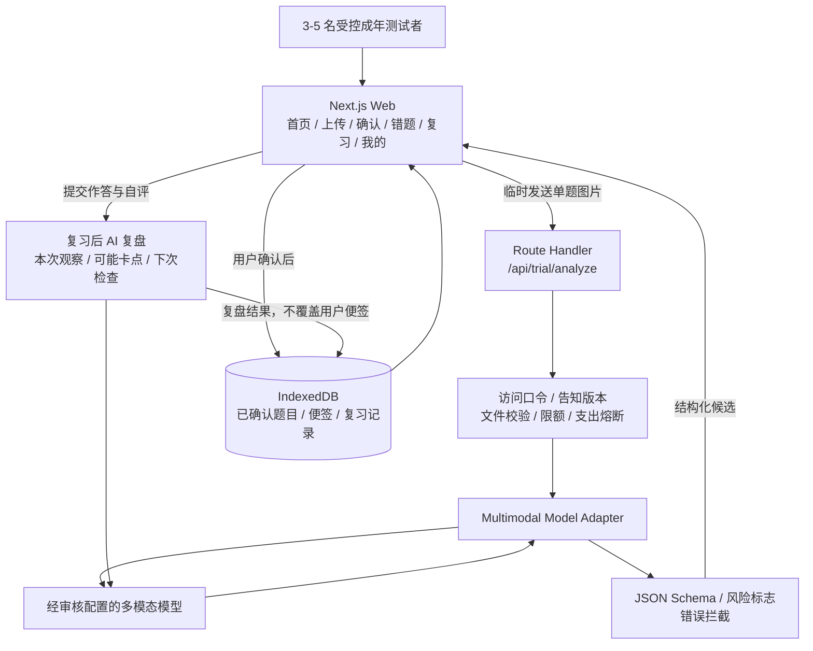
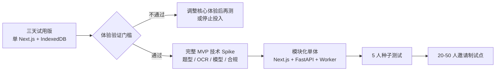
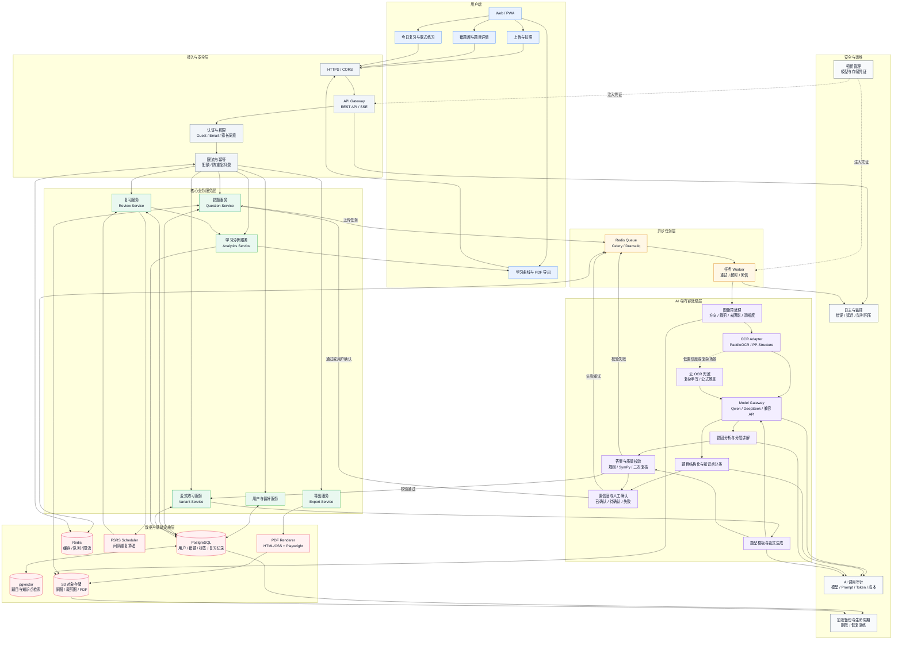

# AI 错题本系统架构图

版本：V1.1  
对应文档：[AI 错题本技术方案](AI错题本技术方案.md)

## 分阶段架构

### 三天受控试用版

试用版服务端不保存原图和结构化题目。图片只在单次分析请求中临时处理；确认后的题目、便签和复习记录保存在浏览器本机。该架构仅用于验证体验，不对外承诺跨设备、备份、恢复、正式身份或未成年人数据权利能力。

### 架构升级路径

试用版到完整 MVP 的稳定边界是：确认页字段 Schema、用户确认状态、个人便签、复习评分枚举和核心页面语言。临时访问口令、IndexedDB 数据层、同步模型请求和单供应商实现均可替换，不作为兼容承诺。

## 完整 MVP 总体架构

## 图例与阅读方式

| 标识 | 含义 |
|---|---|
| 蓝色 | 用户端页面和交互入口 |
| 灰色 | HTTP 接入、认证、限流和幂等控制 |
| 绿色 | 面向业务的领域服务 |
| 黄色 | 异步任务、重试和后台 Worker |
| 紫色 | OCR、模型调用、分析、生成和质量校验 |
| 红色 | 数据库、对象存储、缓存、算法调度和 PDF 渲染 |
| 浅灰 | 安全、审计、监控、备份和密钥管理 |
| 实线箭头 | 主要数据或控制流 |
| 虚线箭头 | 兜底、失败重试或基础设施辅助关系 |

## 与技术方案的对应关系

### 上传与错题结构化

`Web/PWA -> API Gateway -> 错题服务 -> Redis Queue -> Worker -> 图像预处理 -> OCR -> Model Gateway -> 结构化/错因分析 -> 置信度确认 -> PostgreSQL`。

原图、裁剪图和处理结果放在对象存储中，数据库只保存对象键、结构化字段和处理状态。这样可以避免数据库保存大文件，也能支持原图回看和生命周期删除。

### AI 调用与质量控制

所有模型调用经过 `Model Gateway`，业务服务不直接依赖某一家模型厂商。题目分类、错因分析、分层讲解和变式生成使用不同任务模板，并由 `AI 调用审计`记录模型、Prompt 版本、Token、延迟和成本。

`答案与质量校验`负责检查字段完整性、数学表达式、答案一致性和变式题有效性。低置信度结果进入“待确认”状态，不直接作为最终答案展示。

### 复习与学习曲线

复习服务读取题目掌握状态，交给 `FSRS Scheduler`计算下一次复习时间。每次复习结果、提示次数、耗时和自评写入复习记录，再由学习分析服务生成今日任务、知识点趋势和错误类型统计。

### 变式题与 PDF

变式题采用“题型模板 -> 模型生成 -> 答案校验 -> 通过后入库”的链路；校验失败的题目进入重试队列或直接丢弃。PDF 导出由导出服务创建异步任务，使用 HTML/CSS 和 Playwright 渲染，最终文件写入对象存储。

## MVP 实现边界

首版只需要实现以下主链路：

1. Web/PWA 上传图片。
2. 中学数学清晰印刷体 OCR 和题目切分。
3. 结构化题目、知识点、错因和分层讲解。
4. 用户确认后保存错题。
5. FSRS 今日复习和复习记录。
6. 一道经过校验的基础变式题。
7. 选择错题导出 PDF。

以下能力可以延后：复杂手写识别、几何图形自动理解、多学科题库、独立向量数据库、实时协作和教师班级管理。
