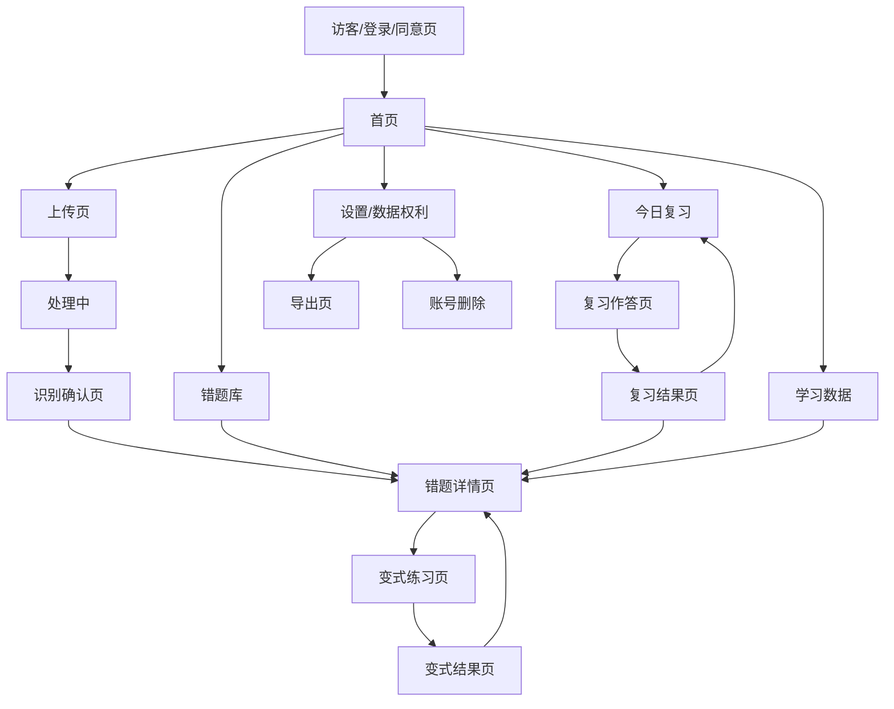

# Recall AI 错题本 UIUX 设计方案

版本：V1.1  
日期：2026-08-08  
范围：三天受控试用版 + 完整 MVP UI / UX 设计基线

## 0. 分阶段体验策略

UIUX 先交付一个可在 3 天内完成的受控试用版，再扩展到本文后续定义的完整 MVP。两阶段使用同一套视觉语言和核心交互原则，避免试用版成为无法演进的一次性演示。

### 0.1 试用版体验目标

试用版只回答四个问题：

1. 用户是否理解上传后必须确认才能入库；
2. 用户是否愿意记录自己的解题便签；
3. 分层提示是否能避免产品退化为直接给答案；
4. 用户是否愿意立即或次日重新完成一次复习。

### 0.2 试用版页面范围

| 页面 | 试用版能力 | 完整 MVP 增强 |
|---|---|---|
| 受控访问/告知 | 访问口令、AI 图片处理告知、开始使用 | 正式账号、监护人同意、协议版本和撤回 |
| 首页 | 上传主操作、待复习数量、最近错题 | 处理中任务、薄弱知识点、动态复习压力 |
| 上传/处理 | 单图单题、预览、提交、真实等待状态 | 拍照、裁剪、质量检测、一图多题、任务恢复 |
| 识别确认 | 原图/结果切换、编辑、确认 | 题目边界、字段置信度、批量确认和版本历史 |
| 错题库 | 本机错题列表、进入详情 | 搜索、筛选、排序、归档和批量操作 |
| 错题详情 | 原题、个人便签、分层解析、复习入口 | 历史记录、AI 纠错、变式题和跨设备同步 |
| 今日复习 | 立即/到期题目、作答、自评、下一次时间 | FSRS 队列、暂停恢复、统计和降级 |
| 我的 | 清空本机数据、查看处理说明 | 账号、数据导出、同意管理和注销 |

学习数据页、变式练习页、PDF 导出页不进入三天试用版，但保留在完整 MVP 信息架构中。

### 0.3 试用版导航与交互

- 仍保留：首页 / 错题 / 复习 / 我的，确保试用结论可迁移到完整 MVP。
- 上传仍是首页主操作，不增加 AI 聊天或搜索框。
- 识别完成后必须进入确认页，不允许直接跳到详情或完整答案。
- 个人便签位于标准解析之前；完整解析默认折叠。
- 试用版创建错题时只把“科目”作为正式分类；知识点和错因可以作为 AI 参考，但不作为用户必须确认的主分类。
- 试用版不展示伪置信度、伪进度、虚构统计或尚未实现的禁用入口。
- 不属于试用版的完整功能不做“即将上线”占位，避免干扰核心任务观察。

### 0.4 试用版可用性门槛

- 360px 宽度下完成核心链路，无横向页面溢出和操作遮挡；
- 首次使用者不经口头指导即可找到上传入口；
- 确认按钮与“AI 结果尚未入库”的状态表达清楚；
- 页面刷新后，本机已确认错题和复习记录仍存在；
- 模型失败、结构异常、本地保存失败均有清晰重试或退出路径；
- AI 识图失败时可保存为传统错题，只保留原图和便签，不展示 AI 复盘或 AI 解析。

## 1. 设计目标

Recall AI 是一款错题复习软件，不是 AI 搜题软件。UI / UX 的目标不是制造复杂感，而是让用户快速完成三件事：

1. 上传错题；
2. 确认题目并入库；
3. 复习、记录便签、形成个人错题资产。

设计优先级：

- 清晰 > 花哨
- 信任 > 炫技
- 行动 > 浏览
- 个人理解 > 标准答案

## 2. 产品气质

### 2.1 视觉方向

采用“Codex 式简约骨架 + 柔和学习色彩 + 轻不对称布局”。

关键词：

- 简约
- 可信
- 清爽
- 安静
- 学习工作台
- 轻不对称

### 2.2 颜色策略

基础色：

- 背景：近白、浅灰、轻冷调
- 文字：深蓝黑，不用纯黑
- 分割线：浅灰蓝

状态色：

- 青绿色：主操作、完成、掌握
- 琥珀色：低置信度、需确认、提示
- 蓝色：处理中、AI 分析
- 红色：删除、危险操作

### 2.3 风格原则

- 不做课程 App 的热闹感
- 不做游戏化学习
- 不做纯黑白极客风
- 不把 AI 做成聊天主角
- 允许局部不对称，但不破坏阅读秩序

## 3. UX 总原则

### 3.1 渐进式熟悉感

随着用户使用次数增加，页面语气会从“功能指引”变成“老友式提醒”，但不能油腻。

示例：

- 新用户：今天想处理哪道错题？
- 稳定用户：你已经整理了 12 道错题。
- 回访用户：今天要完成什么？

### 3.2 上传优先，复习增强

错题本面向理科用户，真实心智是“先收进来，有空再看一眼”。因此：

- 首页主操作以上传为起点
- 当待复习任务累积后，复习按钮权重增强
- 复习权重按待复习压力变化，不按上传总数机械变化

### 3.3 先完成，再优化

MVP 先用最少规则跑通，不追求复杂动画和策略：

- 0 个待复习：上传优先
- 有待复习：复习增强
- 有逾期任务：复习成为主按钮

### 3.4 AI 低显性原则

AI 嵌入流程，但不作为主入口。

- 不做首页 AI 聊天入口
- 不做“问 AI”主按钮
- 只在识别、错因、提示、解析、变式生成等节点出现
- 复习提交后增加“AI 复盘”结果区，让用户看到 AI 在理解和复盘中的作用
- 所有 AI 输出都必须可确认、可修改、可纠错

### 3.5 防搜题化原则

产品必须明确避免退化为 AI 搜题软件：

- 上传后先确认，不直接进入错题库
- 标准解析默认折叠
- 复习页先作答，再看提示
- 变式题先提交，再看批改
- 默认展示“我的便签”，不是 AI 解析
- 不要求用户按 AI 给出的知识点或错因维护错题；用户自己的理解记录优先
- AI 复盘只作为本次作答后的辅助判断，不自动覆盖便签、分类或复习排期

### 3.6 AI 复盘区

AI 复盘区出现在用户完成一次复习并提交自评之后，位置在“我的解题便签”之后、录入时的“AI 参考”和标准解析之前。

固定展示四项：

- 本次观察：这次作答最值得注意的变化；
- 可能卡点：基于本次作答的谨慎推测；
- 下次先检查：下一次做题前只给一个优先检查动作；
- 便签建议：用户可以自行改写进便签的提醒。

交互规则：

- 复习记录先保存，AI 复盘异步生成；
- 生成中显示“正在复盘这次作答”，并说明不影响复习记录；
- 生成失败显示降级提示，不阻断用户继续使用；
- 不做聊天输入框，不自动展开完整解析；
- 明确标注“这是辅助判断，不替代你的理解”。

## 4. 信息架构

### 4.1 底部导航

底部导航固定为 4 项：

- 首页
- 错题
- 复习
- 我的

上传不进入底部导航，作为首页主操作存在。

### 4.2 核心路由



## 5. 页面设计

### 5.1 访客 / 登录 / 同意页

目标：极简进入，不做营销页。

布局：

```text
[品牌名]
[一句话定位]

[主按钮] 开始使用
[次按钮] 我已有账号

[说明区]
- 上传错题后自动结构化
- 先确认再入库
- 支持删除和导出
```

### 5.2 首页

首页是核心入口，采用上传驱动 + 复习增强的动态结构。

移动端建议：

```text
[问候 + 状态]
[大卡：今日待复习 / 上传错题]
[小卡：上传 / 处理中]
[最近错题]
[薄弱知识点]
[底部导航]
```

首页规则：

- 0 个待复习时，上传卡最大
- 有待复习时，复习卡逐渐增强
- 页面结构尽量稳定，只调整层级权重

### 5.3 上传页

上传页偏扫描工具感。

布局：

```text
[顶部：返回 / 标题 / 帮助]
[大预览区]
[质量提示浮层]
[底部主按钮：拍照上传]
[底部次操作：从相册选择]
```

要求：

- 预览区占主要视觉
- 质量提示做成轻浮层
- 主按钮固定底部

### 5.4 识别确认页

这是建立信任的关键页面。

布局：

```text
[顶部：进度 / 题目序号]
[原图预览]
[识别字段]
  - 题干
  - 学生答案
  - 正确答案
  - 知识点
  - 错因
[低置信度提示]
[底部按钮：修改 / 确认保存]
```

规则：

- 上传完成不等于正式入库
- 识别结果必须经用户确认
- 正确答案可展示，但不要成为第一视觉
- 标准解析默认折叠

### 5.5 错题详情页

错题详情页应是“个人理解档案”，不是答案页。

优先级：

```text
原题
> 我的便签
> 复习状态
> AI 提示 / 标准解析
> 变式练习
> 历史记录
```

移动端布局：

```text
[顶部：返回 / 状态 / 更多]
[题目卡]
[我的解题便签]
[复习状态]
[折叠区：AI 提示]
[折叠区：标准解析]
[按钮：开始复习]
[按钮：来一道同类题]
```

便签规则：

- 复习结束后主动提示填写或更新
- 错题详情页可随时编辑
- 再次打开错题时优先看到自己的便签
- 传统错题详情页只强调原图和便签，不显示“开始复习”、AI 参考或 AI 复盘，避免用户误以为已经完成 AI 分析。

### 5.6 今日复习页

第一版以原题复习为主，保持路径短。

流程：

```text
打开复习 -> 看原题 -> 自己作答 -> 看提示/答案 -> 选择掌握情况 -> 更新下次复习
```

布局：

```text
[顶部：今日进度]
[主题目卡]
[输入区]
[提示层]
[底部反馈：困难 / 一般 / 掌握]
[下一题]
```

### 5.7 变式练习页

变式题作为可选增强，不绑进主复习链路。

布局：

```text
[顶部：变式题标签]
[题目区]
[作答区]
[校验提示]
[提交后批改]
```

规则：

- 先提交后解析
- 不支持时明确提示，不展示未校验内容

### 5.8 错题库页

错题库是长期资产页，不是相册。

布局：

```text
[搜索框]
[筛选芯片]
[知识点分组]
[错题卡列表]
```

默认排序：

- 待复习优先

可切换：

- 最近上传
- 最近复习
- 知识点

卡片只展示：

- 题目摘要
- 知识点
- 错因
- 掌握状态
- 下次复习时间
- 是否有便签

### 5.9 学习数据页

数据页只做行动相关指标，不做复杂报表。

建议内容：

- 本周完成率
- 待复习数量
- 薄弱知识点 Top 3
- 错误类型分布

### 5.10 我的 / 设置页

内容：

- 账号信息
- 数据导出
- 数据删除
- 提醒设置
- 主题设置
- 同意状态

## 6. 组件规则

### 6.1 卡片

- 圆角偏小，建议 16-24px
- 主卡允许更大面积
- 列表卡克制、整齐、层级分明

### 6.2 按钮

- 主按钮用青绿色
- 次按钮低对比
- 危险按钮只用于删除/注销
- 首页主按钮可按待复习压力动态增强，但第一版尽量保持稳定

### 6.3 标签

- 青绿：掌握 / 完成
- 琥珀：待确认 / 低置信度
- 蓝色：处理中
- 灰色：普通状态

### 6.4 提示

- 提示短句化
- 不责备
- 不鼓励式过载
- 不使用夸张拟人语气

## 7. 文案语气

语气系统：

- 不催促
- 不评判
- 不装可爱
- 不承诺提分
- 用下一步动作代替空泛鼓励

语气示例：

- 今天想处理哪道错题？
- 有 4 道错题等你确认一下会不会写。
- 这 3 道已经处理完。

## 8. MVP 交付边界

必须做：

- 首页
- 上传页
- 识别确认页
- 错题详情页
- 今日复习页
- 变式练习页
- 错题库页
- 学习数据页
- 我的 / 设置页

暂缓：

- 社交
- 排行榜
- 复杂动画
- 重度游戏化
- AI 聊天入口
- 复杂报表

## 9. 结论

Recall AI 的第一版 UI / UX 应该是：

- 极简
- 可信
- 清爽
- 有一点不对称
- 但不破坏秩序
- 有熟悉感，但不油腻
- 以错题复习为主，不以 AI 搜题为主

这份方案的核心不是“看起来像什么”，而是“用起来像什么”。
