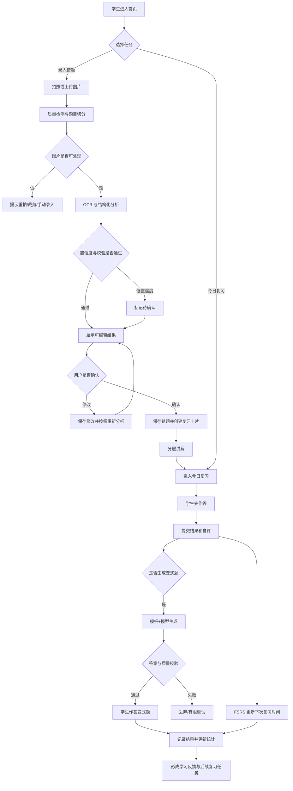

# Recall AI 错题本产品需求文档（PRD）

版本：V2.0  
状态：MVP 产品评审基线  
日期：2026-08-06  
适用团队：产品、设计、前端、后端、AI 算法、测试、运营  
资料来源：《AI 错题本产品想法验证报告》《AI 错题本技术方案》《AI 错题本系统架构图》

---

## 1. 产品背景与机会

### 1.1 用户正在经历什么

错题复习被普遍认可，但真实执行成本很高。学生需要抄题、裁图、分类、记录错因，再决定何时复习；这一过程往往比重新做一道题更麻烦。最终，大量错题停留在纸质本、相册或收藏夹中，没有形成持续复习。

现有拍照搜题产品解决了“这道题答案是什么”，却没有完整解决以下问题：

- 这道题为什么会错；
- 学生接下来应该何时再做；
- 看懂解析后，是否真的会做同类题；
- 一段时间后，哪些知识点仍然薄弱。

因此，用户缺少的不是另一个答案入口，而是一套把个人错题持续转化为学习行动的工具。

### 1.2 市场现状与切入机会

拍照识别、题目解析和错题收藏已经被头部产品验证，说明需求成立；但作业帮、小猿 AI 等产品拥有大规模题库和内容生态，新产品不应正面竞争题库数量或答案速度。

Recall AI 的切入机会是经营学生自己的错题资产：用 AI 降低录入和理解成本，再用确定性的复习机制推动行动，用经过校验的变式题验证迁移。产品竞争点从“一次搜到答案”转为“持续减少同类错误”。

### 1.3 为什么现在值得做

| 条件 | 已具备的基础 | 对产品的意义 |
|---|---|---|
| 用户习惯 | 拍照搜题、电子错题本已被广泛教育 | 无需重新培养拍照录入习惯 |
| AI 能力 | OCR、多模态理解、结构化输出和数学模型可调用 | 可显著减少手工整理和初步分析成本 |
| 工程能力 | FSRS、异步任务、对象存储、模型网关均有成熟方案 | 小团队可以低成本完成闭环 MVP |
| 差异化空间 | 大平台侧重全场景，新产品可聚焦个人复习 | 可通过低干扰、可信和数据可控建立认知 |

### 1.4 产品机会结论

这个方向值得验证，但成立条件不是“AI 能解题”，而是学生愿意持续回来复习，并能通过变式练习减少同类错误。因此，MVP 的优先级必须是复习闭环，而不是题库规模或生成内容数量。

---

## 2. 目标用户与核心问题

### 2.1 首发用户

| 角色 | 用户特征 | 使用动机 | 产品关系 |
|---|---|---|---|
| 核心用户：学生 | 初一至高三，可独立使用手机或电脑，有错题整理或考前复习需求 | 少花时间整理，知道为什么错，避免重复犯错 | 直接使用产品并产生学习数据 |
| 付费决策人：家长 | 关注学习效果、时间投入和数据安全 | 孩子真正形成复习，而不是用 AI 抄答案 | 决定是否购买，不是首版日常操作者 |
| 支持角色：运营/审核员 | 服务小规模试点，处理失败和低置信度任务 | 保证结果可信并沉淀错误样本 | 最小权限处理指定任务 |

首发选择中学生和数学，是因为该群体能够自主操作，错题与考试复习场景明确；数学具备较清晰的知识点、题型和可校验答案，能够验证完整闭环。小学、全学科和复杂竞赛题不在首发范围。

### 2.2 四个核心问题

| 用户问题 | 当前做法的不足 | 造成的结果 | 产品必须解决什么 |
|---|---|---|---|
| 整理错题耗时 | 手抄、截图、裁剪、分类均需人工完成 | 学生放弃整理或只保存照片 | 将图片快速转为可编辑的结构化错题 |
| 错题只收藏不复习 | 纸质本和收藏夹不会主动安排复习 | 错题资产不断增加，但掌握没有改善 | 自动生成今日任务并持续调整复习时间 |
| 看懂解析但不会迁移 | 标准答案只能解释原题 | 遇到同类题仍然不会做 | 用同知识点变式题检测是否真正掌握 |
| AI 结果不可信 | OCR、数学推理和生成题都可能出错 | 错误内容直接伤害学习效果 | 原图核对、置信度、人工确认和工具校验 |

### 2.3 用户真正需要的结果

学生并不需要更多错题，而需要更少的重复错误。产品应让用户在一次错题处理后获得三个结果：题目已经整理好、下一次复习已经安排好、是否真正掌握可以被检测。

---

## 3. 产品定义与目标

### 3.1 产品定义

**产品名称：** Recall AI 错题本（暂定）  
**产品形态：** 移动端优先、兼容桌面的 Web/PWA 学习工具  
**首发学科：** 中学数学  
**一句话定位：** 会复习的 AI 错题本，而不是只会给答案的搜题工具。

Recall AI 将学生自己的错题从图片转化为一条可理解、可复习、可检测的学习任务。产品通过 AI 完成高成本的识别和分析，通过复习算法决定下一步行动，通过用户确认和数学工具校验保证结果可控。

### 3.2 产品目标

| 目标层级 | 目标 | 判断方式 |
|---|---|---|
| 用户目标 | 显著减少整理时间，并帮助学生完成复习和同类题迁移 | 录入成功率、复习完成率、变式题结果 |
| 产品目标 | 建立“录入—理解—复习—检测—反馈”的最短闭环 | 核心链路完成率和 7 日行为 |
| 业务目标 | 验证用户是否愿意持续使用，并为节省时间和复习效果付费 | 留存、付费测试和退款原因 |

### 3.3 核心价值主张

> 上传一道错题，不只是得到答案，而是得到一条已经整理、安排好复习时间，并能检测是否掌握的学习任务。

### 3.4 产品不追求什么

- 不与头部产品竞争题库规模和搜题速度；
- 不提供直播课、课程商城、真人答疑或学生社区；
- 不以延长使用时长或增加答案浏览量作为成功标准；
- 不承诺提分，不替代教师和家长判断；
- 不在无法确认答案正确性时向用户展示确定性结论。

---

## 4. 产品方案与主要功能

### 4.1 产品如何解决问题

这条链路只在学生完成复习并产生新的掌握记录后闭合。上传成功、查看解析或收藏题目都不等于产品价值已经实现。

### 4.2 六项主要功能

| 主要功能 | 解决的问题 | 用户获得的结果 | MVP 关键能力 |
|---|---|---|---|
| 1. 智能错题采集 | 手抄、裁图和分类耗时 | 拍一张图即可得到一道或多道可编辑错题 | 拍照/截图、一图多题、质量检测、OCR |
| 2. 可确认的 AI 分析 | OCR 和 AI 可能犯错 | 用户清楚看到哪里不确定，并保有最终决定权 | 原图对照、字段置信度、编辑、版本记录 |
| 3. 错因与分层讲解 | 只看到答案，不知道为什么错 | 先获得提示，再逐步理解知识点和解法 | 错因分类、提示、关键步骤、完整解析 |
| 4. 自动复习计划 | 收藏后不知道何时再做 | 首页直接出现今天需要完成的错题 | FSRS 排期、今日队列、掌握反馈 |
| 5. 经校验的变式练习 | 看懂原题但不会迁移 | 用相似而不重复的新题检测掌握 | 模板生成、规则/SymPy 校验、先答后看 |
| 6. 个人错题资产 | 内容散落，考前难以集中使用 | 可搜索、筛选、观察薄弱点并导出 | 错题库、学习趋势、复习集合、PDF |

### 4.3 首次价值时刻

用户上传第一道错题后，在 5 分钟内看到可编辑的题目、可能的错因、一个不直接泄露答案的提示，以及已经生成的下次复习时间。这个时刻同时证明产品能省整理时间、帮助理解并推动下一步行动。

### 4.4 AI 在方案中的必要性

AI 只承担传统规则难以低成本完成的任务：题目结构识别、知识点和错因推断、分层讲解及变式生成。账号、权限、复习排期、数据统计、计费、删除和审计由确定性系统负责；数学答案和变式题由工具或规则校验。

如果移除 AI，产品仍可安排复习，但录入和分析成本过高；如果只保留 AI 解题而移除复习、确认与校验，产品会退化为搜题工具。因此，AI 是降低成本和个性化解释的手段，不是产品本身。

---

## 5. 核心用户旅程

### 5.1 典型场景

一名初二学生完成数学作业后发现 3 道错题。他不需要抄题，只需拍摄作业页：

1. 系统切分出 3 道题，并标记一道公式识别不确定；
2. 学生对照原图修正公式，确认题干和自己的答案；
3. 系统判断其中一道可能是移项符号错误，先给出提示，不直接展示答案；
4. 学生重新思考后查看关键步骤，并把错题保存；
5. 第二天，首页出现这道题的复习任务；
6. 学生重新作答，再完成一道经过校验的同类变式题；
7. 系统根据表现安排下一次复习，并把“一元一次方程”掌握趋势更新到数据页。

### 5.2 用户旅程与价值

| 阶段 | 用户行为 | 产品响应 | 用户价值 |
|---|---|---|---|
| 发现错题 | 拍照或上传作业页 | 检测图片并切分题目 | 不再手抄和手工裁图 |
| 确认内容 | 核对低置信度字段 | 保存用户修订并标记版本 | 避免错误识别污染后续结果 |
| 理解错误 | 查看提示、知识点和步骤 | 分层展示讲解并记录反馈 | 保留独立思考，不直接抄答案 |
| 执行复习 | 完成今日到期任务 | 记录表现并更新排期 | 不再自己决定何时复习 |
| 检测迁移 | 作答变式题 | 批改并反馈同类题表现 | 确认是否真正掌握 |
| 考前回顾 | 筛选薄弱点或导出 | 聚合个人错题和趋势 | 形成长期可用的学习资产 |

### 5.3 关键用户故事

- 作为学生，我希望拍照后直接得到可编辑错题，以便省去整理时间。
- 作为学生，我希望 AI 对不确定内容明确提示，以便我能控制最终结果。
- 作为学生，我希望系统先给提示再给答案，以便保留独立思考机会。
- 作为学生，我希望打开产品就知道今天复习什么，以便形成稳定行动。
- 作为学生，我希望用相似但不重复的题检测掌握，以便避免重复犯错。
- 作为家长，我希望数据可删除且不用于广告或训练，以便放心让孩子使用。

---

## 6. 产品特点与差异化

### 6.1 与现有方案的区别

| 对比维度 | 纸质错题本/笔记 | 拍照搜题平台 | 通用大模型 | Recall AI |
|---|---|---|---|---|
| 录入成本 | 高 | 低 | 低 | 低，且形成结构化个人资产 |
| 核心结果 | 保存内容 | 得到答案 | 获得一次回答 | 产生持续复习任务 |
| 是否主动安排复习 | 否 | 部分支持 | 否 | 是，复习是产品主链路 |
| 是否检测迁移 | 依赖人工找题 | 依赖题库 | 可生成但难校验 | 只展示经过校验的适配题型 |
| AI 错误控制 | 无 AI 风险 | 结果机制不透明 | 易产生幻觉 | 原图、置信度、确认、工具校验 |
| 用户数据控制 | 纸质可控 | 取决于平台 | 取决于服务商 | 可编辑、导出、删除，不做广告画像 |

### 6.2 四个产品特点

1. **从答案工具变成行动系统。** 产品首页的主任务是“今天复习什么”，而不是搜索框。
2. **经营用户自己的错题。** 不依赖大题库竞争，重点积累题目、错误过程和掌握变化。
3. **AI 可见、可改、可拒绝。** 识别结果、AI 推断和用户确认明确区分；不确定时不伪装正确。
4. **用迁移结果证明价值。** 是否掌握不靠 AI 宣布，而是通过后续复习和变式作答观察。

### 6.3 产品价值如何形成商业价值

一次搜题是低频、可替代的模型调用；持续复习会形成个人数据、习惯和学习效果反馈。家长更可能为“节省长期整理时间、孩子确实在复习、考前可以集中使用”付费，而不是为一次答案付费。

首版商业验证可采用有限免费次数加考前包或月卡，但不能用增加 AI 次数替代学习价值。付费功能应优先围绕更高录入额度、变式练习、批量导出和学习报告。

---

## 7. MVP 范围与验证目标

### 7.1 MVP 要验证的核心假设

1. 学生愿意用拍照方式持续录入自己的数学错题；
2. AI 结构化与错因结果在用户确认后足够可用；
3. 自动复习安排能让学生在 7 天内再次回来完成任务；
4. 变式练习能让用户感知“看懂”和“会做”的区别；
5. 家长愿意为节省整理时间和持续复习结果付费。

### 7.2 MVP 必须实现

- 移动端上传单张图片，一图多题自动切分并允许人工修正；
- 图片质量检测、OCR、题目结构化和可编辑确认；
- 知识点、错因、置信度和分层讲解；
- 个人错题库的查看、搜索、筛选、编辑、归档和删除；
- 已确认错题自动加入 FSRS 复习计划，并完成今日复习记录；
- 白名单题型至少生成 1 道通过工具校验的基础变式题；
- 基础学习统计、AI 纠错反馈、失败重试、配额和幂等；
- 用户同意、个人数据导出、单题删除和账号注销。

### 7.3 MVP 暂缓与明确不做

| 暂缓能力 | 暂缓原因 |
|---|---|
| 复杂手写和几何图自动理解 | 识别与校验质量不足，容易破坏信任 |
| 高级 PDF 模板、家长完整报告 | 不影响首轮核心价值验证 |
| 外部消息提醒 | 先验证站内复习任务本身是否有价值 |
| 独立向量数据库和开放式 RAG | 无大题库需求，会增加运维和版权风险 |
| 多学科、教师端和班级管理 | 会扩大知识体系和业务边界 |
| 直播课、真人答疑、社区和广告 | 与个人复习定位无关 |

### 7.4 优先级与实现复杂度

| 功能 | 用户价值 | 优先级 | 复杂度 | AI 依赖 |
|---|---|---:|---:|---:|
| 账号、同意与数据权利 | 安全使用 | P0 | 中 | 无 |
| 图片上传、切题与 OCR | 降低录入成本 | P0 | 高 | 高 |
| 结果确认与编辑 | 控制错误传播 | P0 | 中 | 中 |
| 知识点、错因和分层讲解 | 帮助理解 | P0 | 高 | 高 |
| 错题库 | 管理个人资产 | P0 | 中 | 低 |
| 今日复习与 FSRS | 形成持续行动 | P0 | 高 | 无 |
| 白名单变式题 | 检测迁移 | P0 | 高 | 高 |
| 基础学习统计 | 感知薄弱点 | P1 | 中 | 无 |
| PDF 导出 | 考前和离线使用 | P1 | 中 | 无 |

P0 表示缺失后无法验证核心闭环；P1 可在灰度试点期间补齐；P2 为 MVP 后的扩展能力。

### 7.5 MVP 成功标准

**北极星指标：每周完成有效复习的错题数/周活跃学生。**

“有效复习”指学生完成作答并提交，系统记录结果、用时和提示次数，并成功更新下次复习时间。仅打开题目或查看答案不计入。

| 验证环节 | 指标 | 目标 |
|---|---|---:|
| 能否开始使用 | 首次成功录入率 | 建议 >= 70% |
| 能否快速感知价值 | 注册至第一份可用分析中位时间 | 建议 <= 5 分钟 |
| AI 是否可用 | 清晰印刷体结构化成功率 | >= 90% |
| AI 是否被接受 | 结果无需大幅修改即可确认的比例 | > 80% |
| 是否形成复习 | 7 日复习完成率 | > 25% |
| 是否重复使用 | 完成至少 2 次复习的用户占比 | >= 30% |
| 是否发生迁移检测 | 变式题完成率 | 建议 >= 40% |
| 是否具备付费信号 | 试用用户真实付费转化率 | 5%-10% |

### 7.6 试点假设与待确认事项

- 首批采用邀请制，规模为 20-50 名学生；
- 首版仅支持中学数学清晰印刷体和有限白名单题型；
- 站内“今日待复习”是首版主要提醒方式；
- 低置信度任务可由用户确认或经授权进入人工审核；
- 监护人同意方式、真实支付、免费配额和人工审核服务时间需在开工前确认。

---

## 8. 信息架构与核心对象

### 8.1 页面结构

| 一级页面 | 主要内容 | 首要操作 |
|---|---|---|
| 首页 | 今日待复习、最近错题、处理中的任务、薄弱知识点 | 上传错题、开始复习 |
| 上传页 | 拍照/选图、预览、质量提示、上传进度 | 提交处理 |
| 识别结果页 | 原图、题目切分、可编辑字段、置信度、确认状态 | 修改并确认 |
| 错题详情 | 题干、学生答案、错因、知识点、分层讲解、复习状态 | 查看提示、加入复习、生成变式 |
| 错题库 | 搜索、筛选、排序、批量操作 | 找题、归档、加入集合 |
| 今日复习 | 待复习队列、在线作答、反馈、下一题 | 提交作答 |
| 变式练习 | 变式题、作答、批改、讲解 | 提交答案 |
| 数据页 | 完成率、掌握趋势、错误类型、下一步建议 | 进入薄弱点复习 |
| 导出页 | 选题、排序、内容开关、生成状态 | 生成/下载 PDF |
| 设置 | 偏好、同意、数据导出、注销 | 管理数据 |

### 8.2 核心对象

- **上传任务：** 一次图片提交和异步处理过程，可产生多道题。
- **错题：** 经切分和结构化后的单道题，包含原图引用、题干、作答、答案和状态。
- **AI 分析：** 题目的知识点、错因、讲解、风险标志和模型元数据。
- **复习卡片：** 已确认错题对应的 FSRS 调度对象。
- **复习记录：** 一次复习的结果、用时、提示次数、自评和下一次到期时间。
- **变式题：** 基于原题生成并通过校验的练习题。
- **导出任务：** 按筛选条件异步生成 PDF 的任务。

### 8.3 状态定义

**上传/识别状态：** `待上传 -> 上传中 -> 排队中 -> 处理中 -> 待确认 -> 已完成`；任一步可进入`处理失败`，取消后为`已取消`。  
**错题状态：** `草稿/待确认 -> 已确认 -> 已归档 -> 已删除`。仅已确认错题可进入正式复习计划。  
**掌握状态：** `新题 -> 学习中 -> 待巩固 -> 已掌握`，由确定性复习规则计算，AI 不直接修改。  
**变式状态：** `生成中 -> 校验中 -> 可作答`；失败进入`生成失败`，不得展示未校验内容。  
**导出状态：** `排队中 -> 生成中 -> 可下载 -> 已过期`；失败进入`生成失败`。

---

## 9. 核心业务逻辑

### 9.1 核心业务规则

1. OCR 文本和 AI 推断不得静默覆盖用户已确认内容。
2. 用户编辑题干或学生答案后，相关 AI 分析标记为“可能已过期”；用户可触发重新分析。
3. 低置信度字段必须逐项标识；存在关键字段低置信度时，错题不得自动成为已确认状态。
4. 完整答案默认折叠；提示、知识点、关键步骤和完整答案按层级展开，并记录提示次数。
5. 复习排期由 FSRS/确定性算法计算；学生可选择“稍后复习”，但不能由 AI 任意改写到期时间。
6. 变式题只有在答案一致性、字段完整性和重复度检查均通过后才可展示。
7. 所有异步任务必须具备幂等键、有限重试、超时和失败状态，避免重复扣费。
8. 用户删除错题后，应从默认列表和待复习队列即时消失；后台按数据生命周期完成物理删除。

---

## 10. 详细功能需求

## 10.1 F01 访客体验、账号与监护人同意（P0）

**目标：** 降低首次体验门槛，同时满足未成年人数据处理要求。

**主要流程：**

1. 用户首次进入可浏览产品，但上传前必须看到简明隐私说明和 AI 辅助声明。
2. 用户可创建临时访客身份；在跨设备同步、导出或超过试用配额前，引导绑定账号。
3. 系统根据必要信息触发监护人同意流程；具体年龄规则与验证方式由法务确认后配置。
4. 同意状态、版本、时间和撤回记录必须可审计。

**业务规则：**

- 不强制收集学校、真实姓名、精确生日等非必要信息；
- 未完成必要同意时，不得进入图片上传和 AI 处理；
- 用户可在设置中查看、撤回同意并发起注销；
- 撤回后停止新增处理，历史数据按用户选择保留、导出或删除。

**页面状态：** 未登录、待同意、验证中、已同意、同意失败、账号受限。

**异常处理：** 验证失败时保留当前页面输入但不上传题目；账号冲突时提示登录原账号；注销任务异步执行并提供完成状态。

## 10.2 F02 错题上传与图片预处理（P0）

**目标：** 让学生用最少操作提交可处理的错题图片。

**输入：** 相机拍照、相册图片、截图、桌面端拖拽图片。  
**支持范围：** MVP 建议支持 JPG、PNG、WEBP；单图大小和像素上限由技术压测后配置。  
**输出：** 上传任务、原图预览、质量结果和题目切分候选。

**用户流程：**

1. 选择或拍摄图片；
2. 查看预览，进行旋转、裁剪或删除；
3. 系统本地或服务端检测模糊、过暗、遮挡和方向；
4. 用户提交，页面展示上传与处理进度；
5. 系统切分一图多题并进入结构化处理。

**业务规则：**

- 上传前校验格式、大小和配额；
- 使用图片哈希检测同用户重复上传，并提示复用已有结果；
- 原图放入私有对象存储，前端只使用短期签名地址；
- 用户离开页面后任务继续执行，首页可恢复查看状态；
- 一图多题允许用户合并、拆分或删除题目区域。

**页面状态：** 空状态、选择图片、预览、上传中、排队中、处理中、需重拍、失败、已完成。

**异常处理：** 网络中断支持有限重试；格式不支持则上传前阻止；配额不足不创建 AI 任务；图片不可读时提供重拍、重新裁剪和手动录入入口。

## 10.3 F03 OCR、结构化结果与用户确认（P0）

**目标：** 将图片转为可靠的可编辑错题，并阻断错误向后续学习链路传播。

**展示字段：** 题号、题干、选项、学生答案、批改标记、手写过程、公式、正确答案、学科、年级、题型、知识点、错因及各自置信度。

**交互要求：**

- 桌面端原图与结构化文本并排；移动端可在原图/结果间切换；
- 低置信度字段使用明确标记并自动定位；
- 用户可编辑文本、公式、答案、题目边界和标签；
- 支持逐题确认和批量确认高置信度题；
- 用户修改关键字段后，系统提示是否重新运行分析。

**业务规则：**

- OCR 原始结果与用户修订结果分别保存；
- 关键字段包括题干、学生答案、正确答案和公式；任一低于配置阈值时必须确认；
- “AI 推断”与“图片识别”在界面上使用不同标签；
- 已确认内容需保存确认人、时间和版本；
- 重新分析生成新版本，不覆盖历史审计记录。

**失败与空状态：** 无法切题时允许保留整图为单题；未识别到学生答案时明确显示“未识别/未填写”，不得虚构；分析失败时仍可保存手动录入题目。

## 10.4 F04 错题库与错题详情（P0）

**目标：** 让学生持续管理和检索自己的错题资产。

**列表能力：**

- 按知识点、错误类型、难度、掌握状态、年级和时间筛选；
- 搜索题干和知识点；
- 按最近录入、最近复习、下次复习、难度排序；
- 收藏、归档、删除、批量加入复习集合；
- 卡片展示题目摘要、状态、知识点、错因和下次复习时间。

**详情能力：** 原图核对、结构化内容、编辑、重新分析、讲解、复习历史、变式题和删除。

**业务规则：**

- 默认不显示已归档和已删除题目；
- 搜索无结果时保留筛选条件并提供清除入口；
- 删除需二次确认，并说明对复习记录、变式题和导出文件的影响；
- 已删除内容不得被统计、推荐或生成新的复习任务；
- 批量操作展示成功数、失败数和失败原因。

## 10.5 F05 错因分析与分层讲解（P0）

**目标：** 帮助学生理解“为什么错”，同时避免产品退化为直接给答案。

**错因分类：** 知识点不熟、审题错误、计算错误、方法选择错误、表达不规范、粗心、信息不足/无法判断。用户可修改 AI 分类。

**讲解层级：**

1. 给我一个提示；
2. 关键知识点；
3. 解题关键步骤；
4. 完整解析与答案。

**业务规则：**

- 默认只显示提示入口，不自动展开完整答案；
- 每次展开记录层级、时间和题目版本；
- AI 无法依据学生作答判断错因时，必须返回“信息不足”，不得猜测；
- 用户可评价“讲懂了/没讲懂”并提交纠错原因；
- 讲解与当前题目版本绑定，题干变更后显示“需更新”。

**安全兜底：** 模型输出不适当内容、无关内容或格式异常时不展示原始输出，返回可重试状态；连续失败后提供原题保存和反馈入口。

## 10.6 F06 今日复习与复习计划（P0）

**目标：** 把错题从静态收藏转为可完成的每日学习任务。

**创建规则：** 错题确认后默认创建复习卡片，首个间隔建议为 1 天；用户可关闭单题复习或调整计划偏好。

**复习流程：**

1. 首页展示今日到期数量和预计用时；
2. 学生进入队列，先看题并输入或自查答案；
3. 可按需查看提示；
4. 提交后展示正确答案、讲解和自评选项；
5. 用户选择“忘记/困难/一般/容易”；
6. 系统记录结果并由 FSRS 计算下次复习时间；
7. 完成后展示本次总结和下一步行动。

**业务规则：**

- 到期队列优先级建议为逾期题、薄弱知识点、今日新题；
- 不因 AI 推荐任意跳过确定性到期任务；
- 同一次提交必须只生成一条复习记录；
- 用户可暂停并继续，已完成题不重复出现；
- “稍后复习”只允许推迟到配置范围内，并记录行为；
- 完整答案查看次数和提示次数进入复习记录，但不用于惩罚性展示。

**空状态：** 今日无任务时显示“今日已完成”，可进入自由复习或错题库。  
**异常处理：** 保存失败时保留本地作答并重试；FSRS 计算失败使用保守默认间隔并上报监控。

## 10.7 F07 变式练习（P0）

**目标：** 检测学生能否将方法迁移到同知识点、相似结构的新题。

**适用范围：** MVP 仅支持已配置模板和可被规则/SymPy 校验的基础题型。

**生成流程：**

1. 提取原题知识点、题型、难度和变量约束；
2. 选择人工审核模板；
3. 模型生成题干、答案和步骤；
4. 工具校验答案一致性、字段完整性和重复度；
5. 校验通过后展示，失败则有限重试或返回暂不支持。

**业务规则：**

- 默认生成 1 道，用户可在配额内追加至最多 3 道；
- 未校验、校验失败或关键字段低置信度的题不得展示；
- 学生必须先提交作答，才可展开完整答案；
- 记录作答结果、用时、提示次数和来源原题；
- 变式结果可以影响学习统计，但不得直接篡改原题 OCR/分析内容；
- 同一请求通过幂等键避免重复生成和扣费。

**失败状态：** 题型暂不支持、生成失败、校验失败、配额不足、系统繁忙。失败时应给出可理解原因，不展示模型草稿。

## 10.8 F08 学习数据与行动建议（P1）

**目标：** 用简洁数据推动下一次复习，不建设复杂数据大屏。

**展示内容：** 今日/本周复习完成率、连续完成天数、知识点掌握趋势、错误类型分布、平均提示次数、近期需要优先复习的知识点。

**业务规则：**

- 统计只基于已确认错题和有效复习记录；
- 样本过少时显示“数据不足”，不输出强结论；
- 知识点掌握状态必须说明依据，例如最近 3 次复习结果；
- 每个薄弱项提供“开始复习”入口；
- 不展示公开排名，不用负面措辞评价学生。

## 10.9 F09 PDF 导出（P1）

**目标：** 让学生在考前打印或离线使用自己的错题资产。

**配置项：** 题目范围、排序方式、是否包含原图、答案、解析、知识点、错因和复习建议。

**业务规则：**

- 首版使用固定 A4 模板，数学公式、中文字体和图片必须稳定排版；
- 手写过程保留为裁剪图片，不做矢量重排；
- 导出为异步任务，可离开页面后继续；
- 下载链接使用短期签名并显示过期时间；
- 已删除题目不应出现在新导出中；
- 空选题不创建任务，超出数量上限时提示缩小范围。

**页面状态：** 配置、排队、生成中、可下载、生成失败、链接已过期。

## 10.10 F10 反馈、数据权利与系统运营（P0）

**用户能力：** 对 OCR、错因、答案、讲解和变式题分别反馈；导出个人数据；删除单题；注销账号并删除全部关联数据。

**运营能力：** 查看脱敏后的任务状态、失败原因、模型版本、Prompt 版本、延迟和成本；处理人工审核队列；修改知识点树和置信度阈值需版本化。

**业务规则：**

- 反馈必须绑定题目版本和 AI 运行记录；
- 人工审核只开放最小必要内容，访问、修改和导出均记录审计日志；
- 原始图片默认保留 90 天，此为产品建议值，上线前需在隐私政策中确认；
- 用户发起删除后，数据库、对象存储、向量、缓存和未完成任务中的关联数据均应按流程清理；
- 日志不得记录完整题目原文、答案、图片签名地址或敏感身份信息。

---

## 11. AI 能力设计与可行性

### 11.1 AI 可行性结论

中学数学清晰印刷体的 OCR、结构化输出、知识点分类和分层讲解可以通过现有 OCR 与大模型实现；FSRS 和数学规则校验均有成熟组件。真正的技术风险集中在复杂公式、手写过程、几何图理解、错因推断和生成题正确性，因此 MVP 必须使用题型白名单、低置信度确认和确定性工具校验收紧范围。

在 20-50 名邀请制用户范围内，该方案不存在不可突破的技术障碍。建议先用 200 道分层真实题完成 3-5 天技术验证，再决定 OCR 主引擎、置信度阈值和首批题型；未达到质量门槛的题型不进入 MVP。

### 11.2 责任边界

| 任务 | AI/OCR | 后端/规则/工具 | 用户/人工 |
|---|---|---|---|
| 图片方向、清晰度、切分 | 视觉/OCR 辅助 | 文件校验、任务编排 | 用户裁剪、重拍、合并/拆分 |
| 文本与公式识别 | OCR 输出候选和置信度 | Schema 校验、版本保存 | 对照原图修改并确认 |
| 学科/知识点/错因 | 模型分类并给置信度 | 标签合法性和字段校验 | 修改分类；信息不足时补充 |
| 分层讲解 | 模型生成 | 安全过滤、格式校验、数学工具复核 | 逐层查看、评价和纠错 |
| 复习排期 | 不负责 | FSRS 计算和状态机 | 自评、稍后复习、关闭计划 |
| 变式题 | 模型按模板生成 | 模板约束、SymPy/规则校验、去重 | 作答和反馈 |
| 数据统计 | 不直接给结论 | SQL 聚合和可解释规则 | 查看并采取行动 |
| 权限/计费/删除 | 不负责 | 权限、配额、幂等和生命周期 | 授权、撤回、删除 |

### 11.3 AI 输入与输出

| AI 任务 | 输入 | 结构化输出 | 禁止行为 |
|---|---|---|---|
| OCR/切题 | 预处理图片、区域坐标 | 文本块、公式、作答、bbox、置信度 | 丢弃原图或虚构未识别内容 |
| 题目分析 | OCR 文本、用户确认字段、年级范围 | 学科、题型、知识点、错因、风险标志 | 返回标签体系外的未映射值 |
| 分层讲解 | 已确认题干、作答、答案、知识点 | 提示、关键知识点、步骤、完整解析 | 默认只给最终答案或伪造依据 |
| 变式生成 | 题型模板、知识点、难度、变量约束 | 新题干、答案、步骤、校验参数 | 绕过模板或输出未校验题目 |

所有输出必须通过 JSON Schema。解析失败时允许修复性重试 1 次；仍失败则进入失败状态，不直接展示原始文本。

### 11.4 Prompt 逻辑

每个任务独立维护 Prompt，不使用单一万能 Prompt。Prompt 至少包含：

- 角色与任务边界；
- 输入字段及可信度说明；
- 中学数学年级和知识点约束；
- 严格输出 Schema 与枚举值；
- “信息不足”与拒绝猜测规则；
- 分层讲解的答案延迟规则；
- 示例与反例；
- Prompt 版本、模型版本和评测集版本。

Prompt 更新必须先通过离线回归集，再进行小流量灰度；不得直接全量替换。

### 11.5 模型与工具策略

- 通过 Model Gateway 接入 Qwen、DeepSeek 或其他兼容 API，不在业务代码写死供应商；
- 分类、摘要等任务优先低成本模型，复杂数学讲解使用高质量模型；
- OCR 以 PaddleOCR/PP-Structure 为主，复杂场景可切换经审核的云 OCR；
- 数值、代数类答案使用 Python 计算器、SymPy 或规则引擎验证；
- 模型调用记录模型、Prompt 版本、耗时、Token、成本、状态和置信度；
- 同图片、同题目版本和同任务类型可命中缓存，用户修改后缓存失效。

### 11.6 RAG、知识库与记忆

**MVP 结论：不建设开放式内容 RAG。** 产品不自建大题库，避免引入版权、检索质量和额外运维风险。

MVP 使用的知识资源包括：

- 版本化中学数学知识点树；
- 错因分类体系；
- 人工审核的变式题模板和约束；
- 教学讲解风格规范；
- 用户自己的已确认错题和复习记录。

`pgvector` 仅用于相似题去重、个人错题检索和后续实验，不作为首发关键依赖。长期记忆只保存结构化学习数据，不保存开放式人格画像；跨会话上下文仅加载当前题目、必要的年级信息和最近相关复习状态。

### 11.7 人工确认节点

- 关键 OCR 字段低置信度；
- 多题切分边界不确定；
- 学生答案缺失或手写无法识别；
- 错因置信度不足；
- 正确答案或数学校验不一致；
- 用户反馈 AI 结果错误；
- 复杂几何图、超出学科或题型范围。

用户确认优先；试点人工审核只处理用户授权且进入队列的任务。

### 11.8 幻觉与失败控制

1. 输入不完整时返回 `insufficient_information`，不得补写题干或学生答案。
2. 关键结论同时保存置信度和风险标志。
3. 讲解答案使用工具校验或独立复核；变式题必须通过确定性校验。
4. 前端区分原图事实、OCR 识别、AI 推断和用户确认。
5. 低置信度内容不能自动进入已确认、已掌握或可作答状态。
6. 重试必须限制次数并更换兜底路径；连续失败后停止消耗并提示用户。
7. 建立错误样本集，覆盖公式、手写、图文混排、缺失条件、歧义题和模型拒答。

### 11.9 AI 评测方案

| 能力 | 离线指标 | 在线指标 | 发布门槛 |
|---|---|---|---|
| OCR/结构化 | 字段准确率、题目切分 F1、公式准确率 | 用户字段修改率、处理成功率 | 清晰印刷体结构化成功率 >= 90% |
| 知识点分类 | Top-1/Top-3 准确率、标签合法率 | 用户改标签率 | 建议 Top-1 >= 85% |
| 错因分析 | 与教师标注一致率、无法判断召回率 | 用户纠错率、讲懂率 | 建议一致率 >= 75% |
| 讲解 | 答案正确率、步骤有效性、安全性 | 讲懂率、投诉率、答案直开率 | 严重数学错误不得高于评审阈值 |
| 变式题 | 答案一致率、可解率、重复度 | 提交率、纠错率 | 自动校验通过率 100% 后才展示 |

评测集建议由 300-500 道分层样本组成，覆盖初高中年级、题型、印刷质量和常见错因；每次模型或 Prompt 变更对固定回归集全量评测，并由数学教师抽检高风险样本。

---

## 12. 技术架构与落地可行性

### 12.1 落地结论与实施策略

MVP 建议采用模块化单体而不是微服务：Next.js 提供 Web/PWA，FastAPI 承载业务 API，独立 Worker 执行 OCR、AI、变式和 PDF 任务。PostgreSQL、Redis 和对象存储构成最小数据基础设施。Model Gateway 首版作为后端内部适配层实现，不单独部署服务。

在至少 2 名全栈/后端、1 名 AI 工程师、1 名测试，并有产品设计和数学教研兼职参与的条件下，预计 6 周可完成内部可用版本，增加 1-2 周质量加固后可进入 20-50 人试点。若核心研发少于 3 人，应将 PDF、批量操作和高级统计延后，整体排期调整至 8-10 周。

单台云服务器能够支撑早期试点，但 OCR、AI Worker 和 PDF 渲染必须使用独立队列和并发上限。100 名同时在线与日处理 5,000 道题属于扩容目标，必须通过压测验证，不能作为单机天然能力。

### 12.2 推荐架构

| 层 | 方案 | MVP 说明 |
|---|---|---|
| 前端 | Next.js + TypeScript + React + Tailwind CSS | 响应式 Web/PWA，移动端优先 |
| 后端 | FastAPI + Python + SQLAlchemy | REST API，SSE/轮询返回异步状态 |
| 数据库 | PostgreSQL | 结构化数据、JSONB、全文检索 |
| 缓存/队列 | Redis + Celery 或 Dramatiq | OCR、AI、变式和 PDF 异步执行 |
| 文件存储 | S3 兼容对象存储 | 私有桶保存原图、裁剪图和 PDF |
| OCR | PaddleOCR/PP-Structure + 云 OCR 兜底 | 适配器模式 |
| 模型 | 统一 Model Gateway | 多供应商路由、审计、配额和降级 |
| 向量 | PostgreSQL + pgvector | 非首发关键路径 |
| PDF | HTML/CSS + KaTeX + Playwright | 固定 A4 模板 |
| 部署 | Docker Compose + 单台云服务器 | 试点部署，自动备份 |

### 12.3 核心数据流

`上传 -> 私有对象存储 -> 异步预处理 -> OCR -> 结构化/分析 -> Schema 与数学校验 -> 待确认 -> 用户确认 -> 入库 -> 创建复习卡片`。

所有耗时操作返回 `job_id`；前端轮询或通过 SSE 获取状态。任务携带幂等键，同一请求不得重复创建 OCR、AI、变式或 PDF 费用。

### 12.4 核心数据要求

- 用户、同意、上传、错题、答案、OCR、标签、错因、变式、复习卡片、复习日志、导出和 AI 运行记录分别建表；
- 原图与结构化内容分离存储，数据库只存对象键和必要元数据；
- 用户修订、AI 分析和 Prompt/模型版本必须可追溯；
- 删除操作应覆盖 PostgreSQL、pgvector、Redis、对象存储和在途任务；
- 知识点树、错因枚举和变式模板必须版本化。

### 12.5 第三方依赖准入

模型、OCR、对象存储和监控供应商上线前需核验：数据存储位置、是否用于训练、日志保留周期、删除能力、数据出境情况、可用性承诺、内容安全能力和成本上限。供应商不可用时，系统应允许切换、降级或进入待处理状态。

---

## 13. 非功能需求

除标注为已有验收基线的项目外，以下数值均为建议指标，需在试点压测和用户测试后确认。

### 13.1 性能与容量

| 项目 | 建议指标 |
|---|---:|
| 移动端首屏可交互时间 | <= 3 秒 |
| 非 AI 核心接口 P95 | <= 500 ms |
| 上传请求响应/任务创建 P95 | <= 2 秒 |
| AI 首个可见状态反馈 | <= 1 秒 |
| 单题结构化完整结果 P95 | <= 30 秒 |
| 基础变式题生成 P95 | <= 20 秒 |
| PDF 生成（50 题）P95 | <= 60 秒 |
| 首批同时在线用户 | 100 |
| 日处理题目量 | 5,000 道，可配置扩容 |
| 单用户错题容量 | 10,000 道 |

### 13.2 可用性与稳定性

- 试点月可用性建议 >= 99.5%；
- 核心接口错误率 < 1%；
- 异步任务必须有超时、有限重试、死信/失败队列和人工恢复入口；
- 外部模型不可用时允许保存图片和手动题目，延后分析；
- 数据库每日自动备份，建议 RPO <= 24 小时、RTO <= 4 小时，并至少每季度恢复演练；
- 发布采用灰度和可回滚方案，Prompt 与模型配置可独立回滚。

### 13.3 安全、隐私与合规

- 全链路 HTTPS，敏感字段和备份加密，对象存储使用私有桶与短期签名 URL；
- 角色最小权限、后台多因素认证、关键操作审计；
- 上传和 AI 处理前完成必要告知与同意；
- 支持同意撤回、数据访问、导出、更正、删除和注销；
- 不将学生数据用于广告定向、公开排行或供应商模型训练；
- 不在日志中保存完整题目、答案、图片或身份凭证；
- 生成内容标注 AI 辅助，提供纠错入口和内容安全拦截；
- 上线前由专业人士评估个人信息保护、未成年人网络保护、生成式 AI 服务备案/算法及内容安全要求；
- 人工审核必须经过授权、脱敏、保密与访问审计。

### 13.4 兼容性与可访问性

- 兼容最近两个主要版本的 Chrome、Edge、Safari 和主流移动浏览器；
- 适配 360 px 及以上移动端宽度和常见桌面尺寸；
- 核心流程支持键盘操作、明确焦点和足够对比度；
- 状态不能只依赖颜色表达，置信度和错误同时提供文字；
- 数学公式、长题干和大字号设置下不得溢出或遮挡操作。

### 13.5 成本要求

- 每次 AI/OCR 调用记录 Token、模型、费用、耗时与任务类型；
- 使用图片哈希、结果缓存、短结构化输出、每日配额和重试上限控制成本；
- 设定单用户日配额、单任务预算和全局日熔断阈值；
- 试点期月基础设施与模型预算参考 650-3,800 元，不含人力和合规服务，需按真实用量复核。

---

## 14. 埋点与数据闭环

### 14.1 核心事件

| 事件 | 关键属性 | 用途 |
|---|---|---|
| `upload_started` | 来源、格式、大小 | 上传漏斗 |
| `upload_quality_failed` | 模糊/过暗/遮挡 | 优化拍摄指导 |
| `question_processing_completed` | 耗时、题数、OCR 引擎 | 处理质量与成本 |
| `question_confirmed` | 修改字段数、置信度 | 首次成功与 AI 接受度 |
| `ai_result_corrected` | 任务类型、错误类型、模型版本 | 错误样本闭环 |
| `explanation_layer_opened` | 层级、是否先作答 | 防抄答案与讲解价值 |
| `review_started/completed` | 到期状态、结果、用时、提示次数 | 北极星与留存 |
| `variant_generated` | 模板、重试数、校验状态 | 生成质量与成本 |
| `variant_submitted` | 正误、用时、提示次数 | 迁移效果 |
| `pdf_export_completed` | 题数、选项、耗时 | 导出价值 |
| `consent_withdrawn` | 同意版本、处理结果 | 合规审计 |
| `account_deletion_completed` | 耗时、失败资源数 | 数据权利履约 |

### 14.2 数据闭环

用户纠错 -> 绑定题目/模型/Prompt 版本 -> 运营归因 -> 进入脱敏错误样本集 -> 更新规则、Prompt、模型或 OCR -> 离线回归 -> 小流量灰度 -> 线上指标观察 -> 全量发布。

教育质量指标与产品指标分开看：点击率高不等同于学习有效，模型优化不得仅以更多答案展开或更长使用时长为目标。

---

## 15. 验收标准（Given-When-Then）

### 15.1 账号、同意与权限

**AC-01 必要同意**  
Given：用户尚未完成当前版本要求的必要同意  
When：用户尝试上传包含题目的图片  
Then：系统阻止上传，展示简明告知和同意入口，且不创建对象存储文件或 AI 任务。

**AC-02 撤回同意**  
Given：用户已有历史错题并撤回 AI 处理同意  
When：撤回操作成功  
Then：系统停止新的 OCR/AI 任务，保留导出或删除入口，并记录同意版本、时间和操作结果。

**AC-03 越权访问**  
Given：用户 A 已登录  
When：用户 A 请求用户 B 的错题、原图或导出地址  
Then：系统返回无权限，不泄露资源是否存在，并写入安全日志。

### 15.2 上传与预处理

**AC-04 正常上传**  
Given：用户有剩余配额并选择支持格式的清晰图片  
When：用户确认提交  
Then：系统创建唯一上传任务，展示持续可恢复的进度，并保存原图到私有存储。

**AC-05 图片质量不足**  
Given：图片明显模糊、过暗或关键区域被遮挡  
When：系统完成质量检测  
Then：页面说明具体问题并提供重拍、裁剪或手动录入，不将该图片静默当作成功结果。

**AC-06 重复提交**  
Given：同一用户短时间重复提交相同图片和幂等键  
When：第二次请求到达  
Then：系统返回原任务状态，不重复创建 OCR/AI 任务或扣减配额。

**AC-07 一图多题**  
Given：一张清晰图片中包含多道可分割数学题  
When：切题完成  
Then：系统展示多个题目区域，用户可以合并、拆分、删除并逐题确认。

### 15.3 OCR 与结构化确认

**AC-08 低置信度字段**  
Given：题干或公式的置信度低于配置阈值  
When：结构化结果返回  
Then：该字段被明确标记并定位，错题保持待确认状态，不自动进入复习计划。

**AC-09 用户修订**  
Given：用户正在查看 OCR 结果  
When：用户修改题干并保存  
Then：系统保留 OCR 原始值和用户修订版本，将相关 AI 分析标记为可能过期，并提供重新分析选项。

**AC-10 缺失作答**  
Given：图片中没有可识别的学生答案  
When：OCR 和分析完成  
Then：系统显示“未识别/未填写”，不虚构作答或确定性错因。

**AC-11 处理失败降级**  
Given：OCR 或模型连续达到重试上限仍失败  
When：任务终止  
Then：系统展示处理失败、失败阶段和可行操作，允许保存原图或手动题目，并停止继续扣费。

### 15.4 错题库与讲解

**AC-12 搜索筛选**  
Given：用户有多个知识点和状态的错题  
When：用户组合搜索词与筛选条件  
Then：列表仅显示同时满足条件的本人错题，筛选条件在详情返回后保持。

**AC-13 分层讲解**  
Given：用户首次打开一条已确认错题  
When：用户进入讲解区域  
Then：默认只提供提示入口，完整答案折叠，用户可依次展开知识点、步骤和完整答案。

**AC-14 讲解纠错**  
Given：用户认为答案或讲解错误  
When：用户提交纠错反馈  
Then：系统绑定当前题目、模型和 Prompt 版本保存反馈，并标记该结果待复核，不修改用户已确认题干。

**AC-15 删除错题**  
Given：错题已存在复习卡片和变式题  
When：用户二次确认删除  
Then：错题立即从默认列表和待复习队列移除，关联数据进入删除流程，后续统计不再包含该题。

### 15.5 今日复习

**AC-16 创建复习卡片**  
Given：错题处于待确认状态  
When：用户完成确认  
Then：系统只创建一个复习卡片，并按默认策略生成首次到期时间。

**AC-17 完成复习**  
Given：一条复习卡片今日到期  
When：用户作答、提交并选择掌握度  
Then：系统只写入一条复习记录，保存结果、耗时、提示次数和自评，并由 FSRS 更新下次复习时间。

**AC-18 重复提交**  
Given：复习提交已成功但客户端未及时收到响应  
When：客户端用同一幂等键重试  
Then：系统返回原结果，不新增重复复习记录。

**AC-19 今日无任务**  
Given：用户没有到期复习卡片  
When：用户打开今日复习  
Then：系统显示今日已完成，并提供自由复习或返回错题库入口。

**AC-20 算法降级**  
Given：FSRS 计算服务异常  
When：用户提交复习结果  
Then：系统保存复习记录，使用保守默认间隔生成下次时间，并触发监控告警。

### 15.6 变式练习

**AC-21 校验通过**  
Given：原题属于已支持模板且已确认  
When：用户请求生成变式题  
Then：系统生成题干、答案和步骤，完成答案一致性与重复度校验后才进入可作答状态。

**AC-22 校验失败**  
Given：模型生成的答案无法通过工具校验  
When：有限重试仍失败  
Then：系统丢弃模型草稿，提示“暂不生成”，不向用户展示题干、答案或步骤。

**AC-23 先答后看**  
Given：变式题处于可作答状态且用户尚未提交  
When：用户打开题目  
Then：完整答案默认不可见；提交后系统才展示批改和分层讲解。

**AC-24 不支持题型**  
Given：原题包含 MVP 不支持的复杂几何图或题型  
When：用户请求变式题  
Then：系统说明暂不支持，不创建高成本生成任务，并保留原题复习能力。

### 15.7 数据与导出

**AC-25 统计口径**  
Given：用户同时有待确认、已确认和已删除题目  
When：系统计算学习数据  
Then：只基于已确认且未删除题目及有效复习记录统计，并能追溯指标口径。

**AC-26 PDF 导出**  
Given：用户选择有效错题并配置包含答案和解析  
When：导出任务完成  
Then：生成的 A4 PDF 含所选内容，中文、公式和图片无明显缺失或遮挡，并提供短期下载地址。

**AC-27 导出失败**  
Given：字体、图片或渲染服务异常  
When：PDF 生成失败  
Then：任务显示失败和可重试入口，不生成空白或残缺文件供下载。

**AC-28 账号删除**  
Given：用户完成注销确认  
When：删除流程结束  
Then：数据库、对象存储、向量、缓存和未完成任务中的关联数据均被删除或不可恢复匿名化，并向用户展示处理结果。

### 15.8 性能与可靠性

**AC-29 AI 任务耗时**  
Given：清晰印刷体数学题且系统处于设计负载内  
When：执行上传到结构化结果的端到端测试  
Then：P95 不超过 30 秒，且处理期间持续展示真实状态。

**AC-30 模型供应商故障**  
Given：主模型供应商超时或不可用  
When：用户提交新错题  
Then：系统按策略切换供应商或将任务置为待处理，保留已上传数据，不显示伪造成功结果。

---

## 16. 测试与发布门槛

### 16.1 测试范围

- 单元测试：状态机、权限、配额、幂等、FSRS、统计口径和删除编排；
- 集成测试：对象存储、OCR、Model Gateway、队列、PDF 和供应商降级；
- E2E：首次进入、上传、多题确认、讲解、复习、变式、导出、删除；
- AI 回归：固定题集的 OCR、分类、错因、答案和变式校验；
- 安全测试：越权访问、签名 URL、上传文件、Prompt 注入、后台权限和日志泄露；
- 兼容测试：主流移动浏览器、桌面浏览器、弱网、页面刷新和任务恢复；
- 可用性测试：至少 5 名初中生与 5 名高中生完成核心链路观察。

### 16.2 发布阻断项

出现以下任一情况不得进入公开试点：

- 未完成必要的隐私告知、同意、删除或越权防护；
- 低置信度结果可绕过确认直接进入已掌握状态；
- 未校验变式题可展示；
- 重复请求会重复扣配额或产生重复复习记录；
- 清晰印刷体结构化成功率低于 90%；
- 严重数学错误率超过评审阈值且无拦截；
- 无法完成对象存储和数据库关联数据删除；
- 核心流程存在阻断性崩溃或数据丢失。

### 16.3 灰度策略

1. 内部测试账号验证 50-100 道题；
2. 5 名种子用户灰度，人工检查所有低置信度结果；
3. 扩展至 20 名用户，每 100 道至少抽检 20 道；
4. 达到质量门槛后扩展至 50 名用户并开启留存实验；
5. 付费实验须独立开关，明确退款和权益规则。

---

## 17. 开发排期与交付物

| 阶段 | 时间 | 产品/设计交付 | 研发/测试交付 |
|---|---:|---|---|
| 技术验证 | 3-5 天 | 首批题型、质量口径、低保真主链路 | 200 道样本 Spike、供应商与合规清单 |
| 第 1 周 | 基础骨架 | 上传/首页/错题库交互稿 | 账号、同意、上传、存储、数据库 |
| 第 2 周 | OCR 链路 | 结果确认和状态设计 | 预处理、OCR、切题、编辑和任务状态 |
| 第 3 周 | AI 分析 | 错因与分层讲解体验 | Model Gateway、Schema、校验、审计 |
| 第 4 周 | 复习闭环 | 今日复习、反馈和数据页 | FSRS、复习日志、基础统计 |
| 第 5 周 | 迁移与导出 | 变式练习、PDF 配置 | 模板生成、SymPy 校验、PDF、批量操作 |
| 第 6 周 | 内部可用版 | 可用性修订、运营手册 | 全链路回归、监控、发布阻断项检查 |
| 第 7-8 周 | 试点加固 | 种子用户观察、问题优先级 | 灰度、性能与安全修复、错误样本闭环 |

关键交付物包括：高保真原型、接口文档、数据字典、状态机、Prompt 与 Schema、AI 评测集、测试用例、隐私文本、运营审核手册、监控看板和发布检查表。

---

## 18. 风险与应对

| 风险 | 概率 | 影响 | 预防与兜底 | 责任角色 |
|---|---:|---:|---|---|
| OCR 错误导致全链路错误 | 高 | 高 | 原图对照、字段置信度、用户确认、错误集回归 | AI/产品 |
| AI 数学答案错误 | 中 | 高 | 工具校验、二次复核、风险标志、纠错入口 | AI/教研 |
| 学生直接抄答案 | 高 | 中 | 分层提示、先作答、记录展开层级 | 产品 |
| 用户不回来复习 | 高 | 高 | 首页行动入口、站内提醒、FSRS、访谈验证 | 产品/运营 |
| 变式题无效 | 中 | 高 | 人工模板、约束生成、确定性校验、抽检 | AI/教研 |
| 模型成本失控 | 中 | 高 | 缓存、任务分级、配额、重试上限、成本熔断 | 后端/运营 |
| 未成年人数据风险 | 中 | 极高 | 最小采集、同意、加密、删除、供应商审计 | 产品/法务/安全 |
| 与头部产品同质化 | 高 | 高 | 聚焦个人复习闭环、低干扰、数据可控 | 产品/市场 |
| 人工审核不可规模化 | 中 | 中 | 仅处理高风险样本、积累规则与评测集 | 运营/AI |
| 题目版权争议 | 中 | 高 | 仅保存用户自有上传、限制公开分享、建立投诉流程 | 法务/产品 |

---

## 19. 产品验证计划

| 周期 | 实验 | 样本 | 通过标准 |
|---|---|---:|---|
| 第 1 周 | 学生与家长访谈 | 15 名学生、10 名家长 | 至少 15 人每周有稳定错题，至少 10 人愿意试用 |
| 第 1 周 | 落地页预约 | 真实流量 | 预约转化 >= 8%；低于 3% 重做定位 |
| 第 2 周 | 人工辅助 MVP | 20 名学生 | 每人完成至少 10 道录入 |
| 第 3 周 | 自动 OCR 与分析 | 试点题目 | P95 < 30 秒，用户可接受率 > 80% |
| 第 4 周 | 复习与变式 | 试点用户 | 7 日复习完成率 > 25%，30% 用户完成至少 2 次复习 |
| 第 4-6 周 | 真实付费测试 | 符合条件试用用户 | 付费转化 5%-10%，并记录退款与原因 |

决策规则：若录入成功但复习留存不达标，优先优化复习触达和任务体验，不扩展 OCR/学科；若 AI 修改率过高，暂停扩大用户量；若付费不足，先验证价值与权益，不以增加模型调用次数掩盖问题。

---

## 20. 完整性、可行性与一致性审核

### 20.1 完整性检查

| 检查项 | 结果 | 说明 |
|---|---|---|
| 用户、痛点、目标和场景 | 通过 | 已定义学生、监护人和运营角色 |
| 产品定位与非目标范围 | 通过 | 明确不是搜题、课程或社交平台 |
| MVP 和后续版本 | 通过 | P0/P1/P2 已拆分 |
| 业务与功能流程 | 通过 | 主流程、状态和异常均覆盖 |
| AI 输入输出与责任边界 | 通过 | AI、规则、后端、工具、人工已分工 |
| 数据、安全和合规 | 有条件通过 | 具体监护人同意方案需法务确认 |
| 非功能与成本 | 有条件通过 | 多数为建议指标，需压测校准 |
| 验收标准 | 通过 | 重要功能均提供 Given-When-Then |
| 数据指标与验证 | 通过 | 包含北极星、漏斗、质量和反向指标 |

### 20.2 可行性检查

- 技术栈成熟，OCR、异步任务、Model Gateway、FSRS、SymPy 和 PDF 均有可用方案；
- 在建议团队配置下，6 周可完成内部可用版，增加 1-2 周加固后进入 20-50 人试点；
- 最大不确定性不在基础工程，而在数学题结构化质量、错因可信度、复习留存和付费意愿；
- 不建设题库和开放式 RAG 能有效压缩首版范围与版权风险；
- 若同时要求复杂手写、几何理解、多学科和完整家长端，当前排期不可行，应另行拆期。

### 20.3 一致性检查

- 产品定位、MVP 链路、技术方案和系统架构保持一致；
- 已修正潜在冲突：技术上可接入 pgvector，但产品上不把 RAG 设为 MVP 必需；
- 已明确“复习掌握状态由算法计算”，避免 AI 推断直接改变学习状态；
- 已明确“变式题必须校验后展示”，与可信产品原则一致；
- 已明确 PDF 和学习统计为闭环辅助能力，不高于上传、确认和复习主链路。

### 20.4 PRD 评审结论

**结论：有条件进入 MVP 设计与研发。** 产品问题、主要方案和核心闭环已经明确，现有技术能够支撑邀请制试点。开工前必须确认监护人同意方案、首批支持题型清单、人工审核机制、试点配额和研发人员配置；公开试点前必须完成 AI 回归评测、安全检查、数据删除演练和全部发布阻断项验收。

---

## 21. 附录：首批题型建议

MVP 可优先选择容易结构化和确定性校验的题型：

- 一元一次方程与方程组；
- 整式运算与因式分解；
- 分式与基础函数计算；
- 代数式求值；
- 基础概率与统计计算；
- 有明确公式和数值条件的应用题。

暂缓复杂证明题、开放题、动态图形题、严重依赖几何图的题目、超长手写推导和竞赛题。最终清单需由数学教研与 AI 团队共同评审并形成版本化模板目录。
