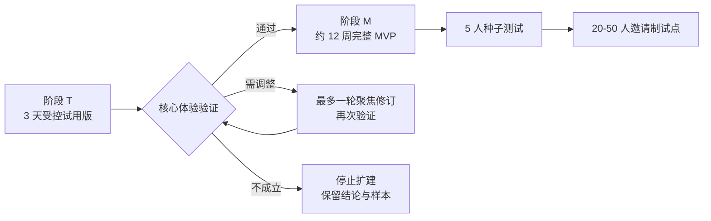
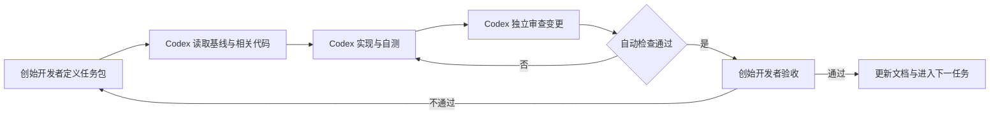
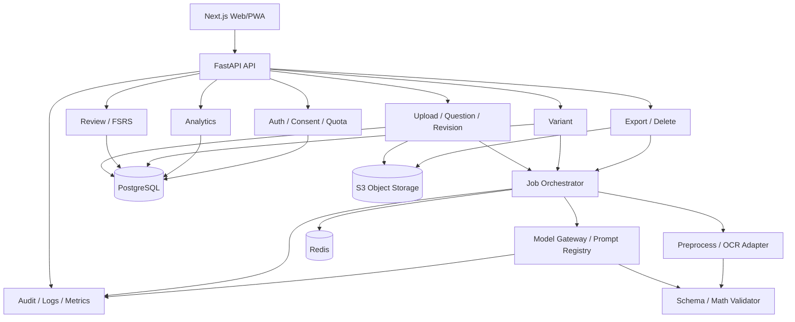

# Recall AI 错题本 MVP 开发规划

版本：V1.1  
状态：试用版优先的开发执行基线  
日期：2026-08-08  
适用模式：一人公司 + Codex 协作开发  
目标：3 个完整工作日完成受控试用版；验证通过后用约 12 周完成完整 MVP、5 人种子测试，并具备扩大到 20-50 人邀请制试点的条件

## 0. 执行路线总览



阶段 T 验证用户体验，阶段 M 验证工程质量、留存、迁移、成本和合规。三天试用版不得被包装成 MVP 或公开产品；完整 MVP 也不得在阶段 T 未形成明确结论前自动开工。

### 0.1 可复用与可丢弃边界

| 类型 | 试用版产物 | 后续处理 |
|---|---|---|
| 必须复用 | 视觉令牌、核心页面结构、结构化结果 Schema、确认状态、便签、复习评分枚举、核心 E2E | 作为完整 MVP 契约输入 |
| 可以演进 | 模型适配器、图片校验、本地数据仓库接口、轻量排期接口 | 保持调用边界，替换内部实现 |
| 应当替换 | 访问口令、IndexedDB 持久化、同步模型请求、单供应商配置 | 不带入公开试点架构 |
| 不形成承诺 | 本机数据迁移、跨设备、备份恢复、未成年人正式使用 | 由完整 MVP 重新设计和验收 |

## 1. 开发总纲

### 1.1 项目目标

本阶段只验证一条核心价值链：

`上传错题 -> AI/OCR 结构化 -> 用户确认 -> 错题入库 -> 到期复习 -> 结果记录 -> 受控变式检测`

上传成功、查看答案或生成内容均不等于 MVP 成功。有效复习必须包含学生作答、提交、自评、复习记录落库以及下一次复习时间更新。

### 1.2 开发原则

1. 纵向闭环优先：每个阶段都交付可运行、可验证的用户路径。
2. 单任务在制：同一时间只保留一个主要开发任务，降低个人开发的上下文切换。
3. 用户确认优先：未确认的识别结果不得成为正式错题或进入复习计划。
4. 确定性规则兜底：权限、配额、幂等、状态机、复习排期、删除和统计不交给 AI 决策。
5. AI 输出受控：所有 AI 输出使用 Schema、置信度、版本、校验和失败状态。
6. 自动检查先行：类型检查、Lint、单元测试、集成测试和关键 E2E 是 Codex 交付的一部分。
7. MVP 完成优先：PDF、高级统计、批量操作和真实支付不得阻塞核心闭环。

### 1.3 默认资源与时间假设

- 人员：1 名全职创始开发者，每周投入 35-40 小时。
- 协作方式：创始开发者负责决策与最终验收，Codex 负责实现、测试、初步审查和文档同步。
- 试用版：3 个完整工作日，面向 3-5 名已知情成年测试者。
- 完整 MVP：试用版通过后，以 12 周为目标、11-14 周为合理浮动区间。
- 技术栈：Next.js + TypeScript、FastAPI + Python、PostgreSQL、Redis 队列、S3 兼容对象存储。
- 架构：模块化单体，Web/API/Worker 可独立运行，不建设微服务。
- 试点：邀请制，先 5 人种子测试，再扩大到 20-50 人。
- 首发范围：中学数学清晰印刷体；复杂手写、强几何依赖、开放题和竞赛题不进入首版。

若每周投入低于 25 小时，应将计划整体调整为 16-20 周，不通过减少测试和安全门槛追回时间。

### 1.4 完整 MVP 范围

#### 必须完成

- 访客身份、账号绑定、必要同意和权限隔离；
- 单图上传、质量提示、一图多题切分、任务状态和失败重试；
- OCR、结构化结果、低置信度标记、人工编辑与逐题确认；
- 知识点、错因、分层讲解、AI 纠错和调用审计；
- 错题库、详情、个人解题便签、搜索、筛选、归档和删除；
- 已确认错题自动建立 FSRS 复习卡片；
- 今日复习、作答、自评、提示次数、用时和下次复习时间；
- 至少一类白名单题型的受控变式生成、确定性校验和作答；
- 基础行动数据、配额、幂等、监控、数据导出和账号注销。

#### 条件完成

以下能力仅在核心 P0 发布门槛全部通过且计划剩余时间不少于 5 个工作日时进入首轮试点：

- 固定 A4 模板 PDF 导出；
- 批量归档和批量加入复习集合；
- 错误类型分布和知识点趋势增强视图。

#### 明确暂缓

- 多学科、教师端、家长完整报告、班级管理；
- 复杂手写过程和复杂几何图自动理解；
- 开放式 RAG、独立向量数据库和公共题库；
- 外部消息提醒、社区、排行榜、课程商城；
- 真实支付系统和复杂订阅权益；
- 高级 PDF 模板和重度运营后台。

## 2. 人机协作职责

### 2.1 责任边界

| 工作 | 创始开发者 | Codex | 最终决定 |
|---|---|---|---|
| 产品范围与优先级 | 制定、取舍 | 分析冲突、提供方案 | 创始开发者 |
| 架构与数据边界 | 审批关键决策 | 起草、实现、记录 ADR | 创始开发者 |
| 代码实现 | 提供目标与约束 | 编码、重构、补充测试 | 创始开发者验收 |
| UI/UX | 确认交互和视觉 | 按页面规格实现与视觉检查 | 创始开发者 |
| AI Prompt 与 Schema | 确认教学边界 | 编写、版本化、运行回归 | 创始开发者/教研 |
| 数学正确性 | 组织样本和专家抽检 | 工具校验、回归统计 | 人工签字 |
| 测试 | 确认风险与覆盖 | 编写并执行自动测试 | 创始开发者 |
| 安全与合规 | 获取专业意见并批准 | 实现控制、整理检查清单 | 创始开发者/专业人士 |
| 发布与回滚 | 决定是否上线 | 执行检查、生成发布记录 | 创始开发者 |

Codex 不得独立批准数学质量、未成年人合规、生产发布、数据删除证明或真实付费上线。

### 2.2 Codex 任务包模板

每次开发只下发一个可验收任务包：

```text
任务 ID：
目标：
用户场景：
输入文档：
允许修改的模块：
禁止修改的范围：
接口/数据约束：
验收标准：
必须执行的测试：
文档同步要求：
```

Codex 完成任务时必须报告修改文件、关键取舍、测试结果、未覆盖风险和需要人工验收的项目。

### 2.3 单任务交付循环



## 3. 里程碑计划

### 3.1 阶段 T：三天受控试用版

#### 3.1.0 详细执行看板

阶段 T 的日常执行、子任务拆分和状态流转，以 `docs/TRIAL_TASK_ALLOCATION.md` 为准。  
这里保留 `T1-01`、`T2-03` 这类父级任务视图，细分到当天可执行的动作时，使用 `T1-05A`、`T1-06A` 这样的后缀任务编号，不再只停留在粗粒度父任务。

基于当前本地 Web 初版重新制定的三天可用产品完成计划，见 `docs/TRIAL_3_DAY_COMPLETION_PLAN.md`。该文档负责定义接下来三天的页面完成标准、验收目标、Day 1/2/3 小任务队列和真实 AI 接入分支。

#### 三天交付范围

```text
受控访问/告知
  -> 单图单题上传
  -> 多模态模型结构化
  -> 用户编辑确认
  -> IndexedDB 错题库
  -> 个人解题便签
  -> 立即或次日复习
  -> 自评与下一次时间
```

#### 第 1 天：打通上传与确认

| ID | 任务 | Codex 主要工作 | 创始开发者验收 | 完成标准 |
|---|---|---|---|---|
| T1-01 | 冻结试用范围和结果 Schema | 整理枚举、示例和错误结构 | 删除所有非必要字段 | Schema 可验证且支持信息不足 |
| T1-02 | 初始化单 Next.js 应用和质量工具 | 脚手架、类型检查、Lint、测试 | 本地运行和移动端首屏 | 一条命令启动，检查全部通过 |
| T1-03 | 受控访问与图片处理告知 | 访问口令、告知确认、会话状态 | 文案和阻断行为 | 未确认告知时不能分析图片 |
| T1-04 | 单图上传与预览 | 文件校验、预览、移除、提交状态 | 真实手机选择图片 | 支持 JPG/PNG/WEBP，错误可恢复 |
| T1-05 | 模型分析 Route 与 Adapter | 服务端调用、超时、限额、Schema 校验 | 使用脱敏样本检查输出 | 密钥不下发，原始自由文本不返回 |
| T1-06 | 原图对照、编辑和确认 | 确认表单、字段编辑、风险标志 | 故意修改识别错误 | 未确认内容不写入错题库 |

第 1 天结束门槛：一张脱敏清晰单题图片可以从上传走到用户确认，刷新前没有未处理异常；若模型链路未打通，停止增加页面，优先修复主链路。

#### 第 2 天：打通错题资产与复习

| ID | 任务 | Codex 主要工作 | 创始开发者验收 | 完成标准 |
|---|---|---|---|---|
| T2-01 | IndexedDB 数据仓库接口 | Schema、版本、CRUD、错误处理 | 刷新和重开浏览器 | 已确认数据可恢复 |
| T2-02 | 首页和四项底部导航 | 上传、待复习、最近错题 | 360px/桌面布局 | 首页上传优先，导航稳定 |
| T2-03 | 轻量错题库和详情 | 列表、题目内容、删除入口 | 多题浏览和删除 | 只展示已确认数据 |
| T2-04 | 个人解题便签 | 新建、编辑、自动保存状态 | 详情再次打开 | 便签显示在标准解析之前 |
| T2-05 | 分层提示和解析 | 提示、关键步骤、完整解析折叠 | 首次打开详情 | 完整答案默认不可见 |
| T2-06 | 轻量复习规则和作答 | 立即/次日任务、作答、自评、下次时间 | 完成一次复习并刷新 | 复习记录唯一且可恢复 |
| T2-07 | 我的与清空本机数据 | 处理说明、删除确认、清空 | 清空后重开应用 | 本机题目和记录全部消失 |

第 2 天结束门槛：完整核心链路在本机可重复完成，且用户自己的便签和复习记录在刷新后仍存在。

#### 第 3 天：加固、部署与验证

| ID | 任务 | Codex 主要工作 | 创始开发者验收 | 完成标准 |
|---|---|---|---|---|
| T3-01 | 失败与边界状态 | 模型超时、Schema 错误、空数据、本地保存失败 | 人工触发每类错误 | 无空白页和死循环 |
| T3-02 | 核心自动测试 | Schema、确认门禁、Repository、排期、E2E | 查看失败可读性 | 核心测试全部通过 |
| T3-03 | 移动端与视觉检查 | 360px/390px/桌面截图和交互修复 | 真机完成核心路径 | 无遮挡、溢出和错误层级 |
| T3-04 | 调用保护 | 文件上限、访问口令、速率/次数限制、支出熔断 | 越界请求测试 | 滥用不会无限消耗模型费用 |
| T3-05 | 受控部署与回滚 | 环境配置、健康检查、停用开关 | 从新设备打开 | 可访问、可停用、无密钥泄露 |
| T3-06 | 试用脚本与记录模板 | 任务脚本、观察表、问题分类 | 执行一次模拟访谈 | 可记录行为而非只收集意见 |
| T3-07 | 3-5 人测试与决策 | 汇总完成率、原话、错误和证据 | 签署继续/调整/停止 | 形成版本化验证记录 |

三天版不以页面数量或代码量验收，而以至少 3 名测试者能否独立完成核心闭环及是否愿意次日复习为准。测试者招募未就绪时，可以完成产品交付，但不得将“验证通过”写入项目状态。

#### 阶段 T 验收门槛

- 至少 3 名测试者独立完成上传、确认、入库、便签和复习；
- 大多数测试者理解产品核心是错题复习，不是拍照搜答案；
- 测试者能识别并修改 AI 错误，确认状态没有歧义；
- 至少 2 名测试者愿意在次日再次使用；
- 没有不可恢复的数据丢失、无限模型调用或密钥泄露；
- 形成 `docs/TRIAL_VALIDATION_RECORD.md`，明确继续、调整或停止。

### 3.2 完整 MVP 总体里程碑

| 里程碑 | 周期 | 交付结果 | 阶段门槛 |
|---|---:|---|---|
| M0 技术验证与规格冻结 | 试用通过后第 1 周 | 样本 Spike、核心工程规格、仓库演进 | OCR/AI 路线可行，P0 范围冻结 |
| M1 基础平台 | 第 2 周 | 账号、同意、上传、存储、数据库、队列 | 可安全创建和恢复上传任务 |
| M2 识别与确认 | 第 3-4 周 | 预处理、切题、OCR、编辑、确认 | 未确认内容无法进入正式错题库 |
| M3 AI 分析与错题资产 | 第 5 周 | 知识点、错因、分层讲解、便签、错题库 | AI 输出可追踪、可纠错、可降级 |
| M4 复习闭环 | 第 6-7 周 | FSRS、今日队列、作答、自评、复习记录 | 有效复习可完整闭环且幂等 |
| M5 变式检测 | 第 8 周 | 白名单模板、生成、校验、作答 | 未通过校验的题目绝不展示 |
| M6 权利、观测与加固 | 第 9-10 周 | 删除、导出、监控、安全、全链路回归 | 全部发布阻断项通过 |
| M7 种子测试 | 第 11 周 | 5 人测试、错误归因、可用性修复 | 无 P0 阻断，关键质量达标 |
| M8 邀请制试点准备 | 第 12 周 | 20 人灰度配置、运营手册、回滚预案 | 创始开发者签署发布检查表 |

第 12 周只承诺具备扩大试点的条件，不承诺在质量门槛未通过时强行扩容。

表中第 1-12 周均从阶段 T 验证通过并签署继续决策后重新计时。

### 3.3 完整 MVP 详细任务拆分

#### M0：技术验证与规格冻结

| ID | 任务 | 主要产物 | 依赖 | 验收 |
|---|---|---|---|---|
| M0-01 | 建立首批题型与排除清单 | 版本化题型目录 | 教研判断 | 每类题型有支持级别和原因 |
| M0-02 | 准备 50 道代表性样本，定义扩展到 200 道的方法 | 脱敏样本、标注规范 | M0-01 | 覆盖年级、公式、版式和质量差异 |
| M0-03 | 验证 OCR、公式识别、切题和结构化输出 | Spike 报告 | M0-02 | 给出字段准确率、失败类型和供应商选择 |
| M0-04 | 验证讲解与变式 Schema、SymPy 校验路径 | 可运行原型 | M0-01 | 至少一类题型可确定性校验 |
| M0-05 | 编写 API、数据库和页面专项规格 | `API_SPEC`、`DATABASE_SCHEMA`、`UI_PAGE_SPEC` | PRD/UIUX | 核心对象、状态与页面无冲突 |
| M0-06 | 初始化 Monorepo、质量工具和 CI | 可启动仓库 | M0-05 | 前后端启动、Lint、类型检查和测试可运行 |
| M0-07 | 完成供应商与合规决策清单 | 决策记录 | M0-03 | 数据使用、删除、成本和降级均有结论 |

#### M1：基础平台

| ID | 任务 | 主要产物 | 依赖 | 验收 |
|---|---|---|---|---|
| M1-01 | 访客身份、账号绑定和会话 | Auth 模块 | M0-06 | 用户资源严格隔离 |
| M1-02 | 同意版本、撤回与受限状态 | Consent 模块 | M1-01、M0-07 | 未同意时不上传、不创建 AI 任务 |
| M1-03 | PostgreSQL 迁移与基础实体 | 初始 Schema | M0-05 | 可重复迁移和回滚开发环境 |
| M1-04 | 私有对象存储和签名上传 | Storage Adapter | M1-01 | 原图不可公开访问，签名地址短期有效 |
| M1-05 | Redis 队列、Worker、重试和失败状态 | Job 模块 | M1-03 | 超时、有限重试和失败记录可观测 |
| M1-06 | 上传任务状态与首页恢复入口 | 上传基础链路 | M1-04、M1-05 | 刷新页面后仍能恢复真实任务状态 |

#### M2：识别与确认

| ID | 任务 | 主要产物 | 依赖 | 验收 |
|---|---|---|---|---|
| M2-01 | 图片格式、大小、方向和质量检查 | Preprocess 模块 | M1-06 | 不可处理图片给出明确下一步 |
| M2-02 | 一图多题候选切分 | Segmentation Adapter | M2-01 | 用户可合并、拆分、删除区域 |
| M2-03 | OCR Adapter 与结构化 Schema | OCR 模块 | M0-03、M2-02 | 原始结果、bbox、置信度完整保存 |
| M2-04 | 任务状态轮询与真实进度 | Job API/UI | M1-05、M2-03 | 不使用伪进度，失败可恢复 |
| M2-05 | 移动端原图/结果切换与桌面端并排确认 | 确认页面 | M2-03 | 360px 与桌面均可编辑长公式 |
| M2-06 | 字段编辑、低置信度定位和版本记录 | Revision 模块 | M2-05 | OCR 原值和用户修订均可追溯 |
| M2-07 | 逐题确认与唯一复习卡片触发点 | Confirm 服务 | M2-06 | 重复确认不产生重复记录 |
| M2-08 | 识别链路回归集扩充至 200 道 | OCR 评测报告 | M2-03 | 清晰印刷体结构化成功率 >= 90% |

#### M3：AI 分析与错题资产

| ID | 任务 | 主要产物 | 依赖 | 验收 |
|---|---|---|---|---|
| M3-01 | Model Gateway、供应商适配和配置 | AI Gateway | M0-07 | 业务代码不写死模型供应商 |
| M3-02 | 知识点、错因和讲解 Schema | Analysis 模块 | M2-07、M0-05 | 非法枚举和自由文本输出被拦截 |
| M3-03 | Prompt 版本、调用审计、配额和成本记录 | AI Run 模块 | M3-01 | 每次调用可追踪模型、版本、耗时和成本 |
| M3-04 | 分层讲解与答案默认折叠 | 讲解组件 | M3-02 | 默认只提供提示入口 |
| M3-05 | AI 纠错和分析过期机制 | Feedback 模块 | M2-06、M3-03 | 题干修改后旧分析标记过期 |
| M3-06 | 错题库、搜索、筛选、归档和详情 | Question 模块 | M2-07 | 仅展示本人、已确认且未删除数据 |
| M3-07 | 个人解题便签 | Note 模块 | M3-06 | 详情与复习结束后可编辑，优先于标准解析 |

#### M4：复习闭环

| ID | 任务 | 主要产物 | 依赖 | 验收 |
|---|---|---|---|---|
| M4-01 | FSRS Adapter 与默认间隔降级 | Scheduler | M2-07 | 算法异常时仍保存记录并产生保守到期时间 |
| M4-02 | 今日队列查询和排序 | Review Query | M4-01 | 逾期、薄弱点、今日新题顺序稳定 |
| M4-03 | 复习作答、提示层级和本地草稿 | Review UI | M3-04、M4-02 | 刷新/短暂断网不丢失当前作答 |
| M4-04 | 自评、提示次数、用时和复习日志 | Review Command | M4-03 | 同一幂等键只产生一条日志 |
| M4-05 | 复习结果、下一次时间和便签更新 | Result UI | M4-04、M3-07 | 用户清楚看到结果和下一步 |
| M4-06 | 首页按到期压力调整主操作 | Home UI | M4-02 | 0 到期上传优先，逾期时复习优先 |
| M4-07 | 基础行动统计 | Analytics | M4-04 | 统计只含有效复习和未删除确认题 |

#### M5：变式检测

| ID | 任务 | 主要产物 | 依赖 | 验收 |
|---|---|---|---|---|
| M5-01 | 首批模板、变量约束和版本 | Template Registry | M0-04 | 模板经人工审查且可重复生成 |
| M5-02 | 变式生成任务与幂等配额 | Variant Job | M3-03、M5-01 | 重复请求不重复生成或计费 |
| M5-03 | SymPy/规则答案校验和重复度检查 | Validator | M0-04、M5-02 | 校验失败内容不进入可作答状态 |
| M5-04 | 先答后看、批改和反馈 | Variant UI | M5-03 | 提交前答案不可见 |
| M5-05 | 不支持题型与失败降级 | Failure UX | M5-03 | 不展示模型草稿，不阻塞原题复习 |
| M5-06 | 高风险样本人工抽检 | 质量报告 | M5-04 | 可展示变式的自动校验通过率 100% |

#### M6：数据权利、观测与发布加固

| ID | 任务 | 主要产物 | 依赖 | 验收 |
|---|---|---|---|---|
| M6-01 | 单题删除编排 | Delete Workflow | M3-06、M4-04、M5-02 | 列表、队列和统计立即排除该题 |
| M6-02 | 个人数据导出和账号注销 | Rights Workflow | M6-01 | 数据库、对象、缓存和在途任务均覆盖 |
| M6-03 | 日志、错误、延迟、队列和成本监控 | Observability | 全部 P0 | 不记录完整题目、图片地址或凭证 |
| M6-04 | 限流、全局预算熔断和供应商降级 | Reliability | M3-03、M1-05 | 故障时保存上传并进入真实待处理状态 |
| M6-05 | 越权、上传、Prompt 注入和签名 URL 测试 | Security Suite | 全部 P0 | 无严重或高风险未处理问题 |
| M6-06 | 核心 E2E、移动兼容和弱网恢复 | E2E Suite | 全部 P0 | 核心旅程全部通过 |
| M6-07 | 删除演练、备份恢复和回滚演练 | 演练记录 | M6-02、M6-03 | 结果、耗时和失败资源可追踪 |
| M6-08 | 条件实现 PDF/增强统计 | P1 功能 | P0 全绿 | 不影响任何 P0 发布门槛 |

#### M7-M8：试点与迭代

| ID | 任务 | 主要产物 | 依赖 | 验收 |
|---|---|---|---|---|
| M7-01 | 内部完成 50-100 道全链路回归 | 内测报告 | M6 | 无数据丢失和阻断错误 |
| M7-02 | 5 名种子用户可用性测试 | 观察记录 | M7-01 | 初高中用户均覆盖 |
| M7-03 | 全量检查低置信度与严重数学错误 | 质量清单 | M7-02 | 高风险问题均有处置结果 |
| M7-04 | 修复 P0/P1 问题并冻结候选版本 | Release Candidate | M7-03 | P0 为 0，P1 有明确接受结论 |
| M8-01 | 准备 20 人灰度、配额和人工审核排班 | 灰度配置 | M7-04 | 扩容可随时暂停 |
| M8-02 | 完成运营审核手册、事故响应和回滚预案 | Runbook | M6-03 | 单人可在 30 分钟内执行关键操作 |
| M8-03 | 签署发布检查表并开启邀请制试点 | 发布记录 | M8-01、M8-02 | 所有发布阻断项通过 |

## 4. 组件与模块依赖树

### 4.1 试用版依赖树

```mermaid
flowchart TB
    UI[Next.js UI]
    TRIAL_API[/api/trial/analyze]
    GUARD[Access / Consent / Quota]
    ADAPTER[Model Adapter]
    SCHEMA[Result Schema]
    IDB[(IndexedDB Repository)]
    REVIEW[Lightweight Review Rule]

    UI --> TRIAL_API
    TRIAL_API --> GUARD
    GUARD --> ADAPTER
    ADAPTER --> SCHEMA
    SCHEMA --> UI
    UI --> IDB
    IDB --> REVIEW
    REVIEW --> UI
```

试用版不引入 FastAPI、Redis、Worker、对象存储和 PostgreSQL。数据访问、模型调用和复习规则仍通过本地接口封装，以便完整 MVP 替换实现。

### 4.2 完整 MVP 依赖树



### 4.3 完整 MVP 依赖规则

- UI 只通过版本化 API 访问业务数据，不直接连接数据库或对象存储。
- 业务模块可依赖适配器接口，不依赖具体 OCR、模型、队列或对象存储供应商。
- Review 不依赖 AI 推断；只读取已确认题目和确定性复习记录。
- Variant 必须经过 Validator 才能进入 `ready` 状态。
- Analytics 只读取已确认、未删除题目和有效复习日志。
- Delete Workflow 是跨模块编排器，不允许各模块自行形成孤立删除逻辑。
- Observability 接收必要元数据，不接收完整题目、答案、图片和身份凭证。

## 5. MVP API 契约

本节冻结资源命名、关键行为和错误语义；完整字段、示例和 OpenAPI Schema 在 `docs/API_SPEC.md` 维护。

### 5.0 试用版契约边界

试用版只有一个服务端业务接口：`POST /api/trial/analyze`。其 multipart 输入、结构化输出和错误码以 `AI错题本技术方案.md` 的“试用版接口契约”为准。错题、便签和复习记录均由浏览器本地 Repository 管理，不伪造远程 REST API。

完整 `/api/v1` 契约在阶段 T 通过后进入 M0 冻结；试用版 Schema 是其输入证据，不自动成为生产接口。

### 5.1 通用约定

- 基础路径：`/api/v1`。
- 数据格式：JSON；图片通过短期签名 URL 直传私有对象存储。
- 认证：HTTP-only 安全 Cookie 或经评审的等效会话机制。
- 时间：服务端统一保存 UTC ISO 8601，前端按用户时区展示。
- 标识：外部资源 ID 使用不可枚举标识；服务端始终校验资源归属。
- 分页：游标分页，默认 20，最大值由服务端配置。
- 幂等：上传创建、复习提交、变式生成、导出和删除请求必须携带 `Idempotency-Key`。
- 异步：耗时操作返回 `202`、`job_id` 和当前状态；前端轮询任务接口，后续可升级 SSE。
- 版本：用户修改题目时携带资源版本，冲突返回 `409 version_conflict`。
- 错误：不得通过 `403/404` 差异泄露其他用户资源是否存在。

### 5.2 响应与错误结构

```json
{
  "data": {},
  "request_id": "req_xxx"
}
```

```json
{
  "error": {
    "code": "version_conflict",
    "message": "题目已在其他位置更新，请刷新后重试。",
    "details": {}
  },
  "request_id": "req_xxx"
}
```

错误码必须稳定、可测试，用户文案与错误码解耦。最低错误集合：

`unauthorized`、`consent_required`、`forbidden`、`not_found`、`validation_failed`、`quota_exceeded`、`version_conflict`、`idempotency_conflict`、`unsupported_question_type`、`job_failed`、`provider_unavailable`、`rate_limited`。

### 5.3 异步任务状态

`queued -> processing -> needs_confirmation -> completed`

任一步可进入 `failed` 或 `cancelled`。任务响应至少包含：

```json
{
  "id": "job_xxx",
  "type": "question_processing",
  "status": "processing",
  "stage": "ocr",
  "progress": null,
  "retryable": true,
  "error_code": null,
  "created_at": "2026-08-08T00:00:00Z",
  "updated_at": "2026-08-08T00:00:10Z"
}
```

没有可靠进度数据时 `progress` 必须为 `null`，前端展示阶段状态而非伪百分比。

### 5.4 端点清单

| 领域 | 方法与路径 | 行为 |
|---|---|---|
| 身份 | `POST /auth/guest` | 创建最小访客身份 |
| 身份 | `POST /auth/email` | 绑定或登录账号 |
| 用户 | `GET /me` | 获取本人、偏好、配额和同意状态 |
| 同意 | `POST /me/consents` | 记录版本化同意 |
| 同意 | `DELETE /me/consents/{type}` | 撤回指定同意并停止后续处理 |
| 上传 | `POST /uploads/presign` | 创建上传任务并返回签名信息 |
| 上传 | `POST /uploads/{id}/complete` | 确认对象上传完成并开始处理 |
| 任务 | `GET /jobs/{id}` | 获取本人异步任务真实状态 |
| 切题 | `PATCH /uploads/{id}/regions` | 合并、拆分或删除题目区域 |
| 错题 | `POST /questions/from-upload` | 从处理结果创建待确认题目 |
| 错题 | `GET /questions` | 搜索、筛选和游标分页 |
| 错题 | `GET /questions/{id}` | 获取本人错题详情和版本 |
| 错题 | `PATCH /questions/{id}` | 编辑待确认或已确认内容 |
| 确认 | `POST /questions/{id}/confirm` | 确认题目并幂等创建复习卡片 |
| 分析 | `POST /questions/{id}/reanalyze` | 基于当前版本重新分析 |
| 便签 | `PUT /questions/{id}/note` | 创建或更新个人解题便签 |
| 归档 | `POST /questions/{id}/archive` | 归档题目 |
| 删除 | `DELETE /questions/{id}` | 发起关联删除流程 |
| 复习 | `GET /reviews/today` | 返回到期队列和预计用时 |
| 复习 | `POST /reviews/{item_id}/submit` | 保存有效复习并更新 FSRS |
| 变式 | `POST /questions/{id}/variants` | 创建受控变式生成任务 |
| 变式 | `POST /variants/{id}/submit` | 提交答案并返回批改结果 |
| 数据 | `GET /analytics/overview` | 获取行动型基础统计 |
| 反馈 | `POST /feedback` | 提交绑定版本和 AI Run 的纠错 |
| 权利 | `POST /me/data-export` | 创建个人数据导出任务 |
| 权利 | `DELETE /me` | 发起账号注销和关联删除 |
| PDF/P1 | `POST /exports/pdf` | 条件创建 PDF 任务 |

## 6. 开发规范

### 6.1 仓库与架构

试用版只创建一个 Next.js 应用，并保持目录可迁移：

```text
apps/
  web/
    app/          页面与 /api/trial/analyze
    features/     upload / confirm / questions / review / settings
    lib/          model adapter / schema / IndexedDB repository
    tests/        unit / component / core E2E
```

进入完整 MVP 后扩展为 Monorepo：

```text
apps/
  web/          Next.js Web/PWA
  api/          FastAPI API
  worker/       OCR/AI/变式/导出任务
packages/
  contracts/    OpenAPI 生成类型、枚举和共享契约
  ui/           受控共享组件
  config/       Lint、TypeScript 等共享配置
docs/
  decisions/    ADR 与关键技术决策
  evaluations/  AI/OCR 评测口径和结果
```

- 业务边界按 `auth`、`consent`、`upload`、`question`、`analysis`、`review`、`variant`、`analytics`、`rights` 划分。
- 禁止为 MVP 拆微服务；Worker 可独立进程运行，但共享业务契约。
- 外部服务必须通过 Adapter；供应商 SDK 不进入领域层。
- 数据库迁移只能前进式提交，已共享迁移不得静默改写。

### 6.2 编码规范

- TypeScript 开启严格模式；Python 使用完整类型标注和静态检查。
- API Schema、数据库状态枚举和前端状态映射必须有单一事实来源。
- 所有用户资源查询必须显式包含 `user_id`/租户边界。
- 异步任务必须定义幂等键、超时、最大重试、失败码和补偿路径。
- 不在业务代码中读取裸环境变量，由配置模块集中校验。
- 不记录完整题干、答案、图片签名 URL、Cookie、Token 或供应商密钥。
- 对不直观的状态机和删除编排写简短设计注释；避免叙述代码表面行为。

### 6.3 前端规范

- 移动端优先，最低宽度 360px；同时验证常见桌面宽度。
- 底部导航固定为：首页 / 错题 / 复习 / 我的；上传只在首页作为主操作。
- 首页结构稳定，只根据到期压力调整上传与复习的视觉权重。
- AI 识别、AI 推断和用户确认使用不同状态和文案。
- 标准解析默认折叠；个人便签在详情和复习中优先展示。
- 所有加载、空、失败、离线、重试、低置信度和无权限状态必须设计。
- 状态不能只靠颜色传达；长题干、公式和大字号不得遮挡操作。

### 6.4 AI/OCR 规范

- Prompt 按任务拆分并版本化，不使用万能 Prompt。
- 输出必须通过 JSON Schema；修复性重试最多 1 次。
- 输入不足时返回 `insufficient_information`，不得补写题干、作答或错因。
- 题干、学生答案、正确答案或公式低置信度时必须进入确认状态。
- 讲解答案需规则、工具或独立复核；变式题必须确定性校验。
- 每次模型或 Prompt 变更必须运行固定回归集，并保存差异报告。
- 用户修订的已确认内容优先级高于 OCR 和 AI，不得静默覆盖。

### 6.5 测试规范

| 测试层 | 必测内容 | 执行时机 |
|---|---|---|
| 单元测试 | 状态机、权限、配额、幂等、FSRS、统计、删除编排 | 每个任务 |
| 契约测试 | OpenAPI、前后端类型、错误码、任务状态 | 每次 API 变更 |
| 集成测试 | PostgreSQL、对象存储、Redis、OCR、Model Gateway、PDF | 模块完成时 |
| E2E | 同意、上传、切题、确认、讲解、复习、变式、删除 | 每个里程碑 |
| AI 回归 | OCR、分类、错因、答案、讲解和变式校验 | 模型/Prompt 变更 |
| 安全测试 | 越权、签名 URL、恶意文件、Prompt 注入、日志泄露 | M6 与发布前 |
| 兼容测试 | 移动浏览器、桌面浏览器、弱网、刷新恢复 | M2 后持续 |

任何缺陷修复必须先添加可复现测试，或在任务记录中说明无法自动化的原因。

### 6.6 Git 与 Codex 工作规范

- 一个任务 ID 对应一组聚焦变更，避免跨里程碑混合修改。
- Codex 开始前读取项目状态、相关规格和目标模块，不凭聊天记忆实现。
- Codex 不得为了通过测试删除断言、扩大忽略范围或降低质量阈值。
- 变更完成后先运行局部测试，再运行受影响范围的完整检查。
- 关键模块由新的审查上下文检查权限、数据一致性、异常路径和缺失测试。
- 重复出现的 Codex 错误先记录到 `docs/ERROR_LOG.md`；如果暴露出通用工程规则，再同步写回 `AGENTS.md` 或对应目录规则。
- 提交信息包含任务 ID；架构与契约变更同步更新文档。

## 7. 风险矩阵

| 风险 | 概率 | 影响 | 早期信号 | 预防与兜底 | 责任 |
|---|---:|---:|---|---|---|
| OCR/公式识别不达标 | 高 | 高 | 修改率高、切题失败集中 | 第 1 周 Spike、题型白名单、原图确认、云 OCR 备选 | 创始开发者 + Codex 测评 |
| AI 数学答案错误 | 中 | 极高 | 教师抽检出现严重错误 | 工具校验、二次复核、风险标记、暂停扩量 | 创始开发者/教研 |
| 变式题不可解或答案错误 | 中 | 高 | 校验失败率高、用户纠错 | 模板约束、SymPy、失败不展示、人工抽检 | 创始开发者/教研 |
| Codex 产生隐性接口漂移 | 中 | 高 | 前后端类型不一致、状态分叉 | 契约先行、生成类型、契约测试、独立审查 | 创始开发者 |
| 生成代码缺少异常路径 | 高 | 高 | 只覆盖成功场景 | 每个任务强制失败状态和测试清单 | Codex 初检、创始开发者验收 |
| 一人开发上下文切换过多 | 高 | 高 | 多个模块同时半成品 | 单任务在制、纵向切片、每周只设一个主目标 | 创始开发者 |
| 范围膨胀 | 高 | 高 | P1 提前、页面和模型持续增加 | P0 门禁、变更日志、超范围默认进入 Backlog | 创始开发者 |
| 模型/OCR 成本失控 | 中 | 高 | 单题成本和重试率持续上升 | 缓存、配额、重试上限、日熔断、成本看板 | 创始开发者 + Codex 实现 |
| 未成年人数据处理不合规 | 中 | 极高 | 同意/删除方案未定仍准备上线 | 专业审核、最小采集、供应商准入、删除演练 | 创始开发者/专业人士 |
| 数据删除不完整 | 中 | 极高 | 孤立对象或在途任务恢复数据 | 统一删除编排、资源清单、定期演练 | 创始开发者 |
| 用户不回来复习 | 高 | 高 | 7 日完成率低 | 首页动态权重、短复习路径、访谈，不扩学科 | 创始开发者 |
| 单人运维响应不足 | 中 | 高 | 告警过多、故障恢复依赖手工 | 托管服务、Runbook、限流、暂停开关和回滚 | 创始开发者 |
| 熟人试用产生虚假正向信号 | 高 | 中 | 只给态度反馈、依赖开发者指导 | 观察真实操作、禁止代操作、记录行为证据 | 创始开发者 |
| 试用临时代码直接进入生产 | 中 | 高 | IndexedDB/口令开始承载正式用户 | 明确可丢弃边界、阶段 T 后重新做架构评审 | 创始开发者 |
| 试用图片处理边界不清 | 中 | 极高 | 测试者上传含身份或未成年人信息的图片 | 仅成年受控测试、简明告知、无服务端持久化 | 创始开发者 |

## 8. 验收标准

### 8.0 三天试用版验收

- 单张清晰印刷体数学题可得到结构化候选结果；
- 用户可对照图片编辑，且确认前不写入错题库；
- 已确认题、个人便签和复习记录在刷新后仍存在；
- 完整解析默认折叠，复习时先作答再自评；
- 用户可删除单题并清空全部本机应用数据；
- 模型超时、Schema 错误和本地保存失败均有可理解的恢复路径；
- 受控访问、调用上限、密钥隔离和停止开关有效；
- 至少 3 名测试者完成核心路径并形成验证记录。

### 8.1 功能验收

- 用户可在移动端上传单张清晰图片，并处理一图多题。
- 用户可查看、编辑和确认识别字段；未确认题不得进入正式复习。
- 已确认题产生且只产生一个复习卡片。
- 用户可查看个人便签优先的错题详情和分层讲解。
- 用户可完成一次有效复习，系统正确记录结果并更新下次时间。
- 支持题型可生成至少一道通过确定性校验的变式题。
- 用户可反馈 AI 结果、删除单题、导出个人数据并注销账号。

### 8.2 质量验收

| 指标 | 门槛 |
|---|---:|
| 清晰印刷体结构化成功率 | >= 90% |
| 结果无需大幅修改即可确认比例 | > 80% |
| 非 AI 核心接口错误率 | < 1% |
| 上传到结构化结果 P95 | <= 30 秒 |
| 移动端首屏可交互时间 | <= 3 秒 |
| 未校验变式题展示率 | 0% |
| 幂等重复扣费/重复复习记录 | 0 |
| 严重越权和敏感日志泄露 | 0 |

### 8.3 试点验证指标

- 首次成功录入率建议 >= 70%。
- 注册至第一份可用分析中位时间 <= 5 分钟。
- 7 日复习完成率 > 25%。
- 完成至少 2 次复习的用户占比 >= 30%。
- 变式题完成率建议 >= 40%。

这些是产品验证指标，不是通过工程手段伪造的发布指标。未达标时先分析原因，不通过增加 AI 次数、通知轰炸或扩展学科掩盖问题。

### 8.4 发布阻断项

出现以下任一情况不得扩大试点：

- 必要同意、撤回、单题删除或账号注销不可用；
- 存在用户间越权访问或公开对象存储资源；
- 低置信度结果可绕过确认进入正式错题或掌握状态；
- 未校验或校验失败的变式题可展示；
- 重复请求造成重复扣费、任务或复习记录；
- 清晰印刷体结构化成功率低于 90%；
- 严重数学错误超过人工评审阈值且无拦截；
- 数据删除演练无法覆盖数据库、对象、缓存和在途任务；
- 核心旅程存在阻断崩溃、数据丢失或无法恢复的问题。

## 9. 开发节奏建议

### 9.0 三天冲刺节奏

- 每天开始先冻结当日唯一主链路，不新增完整 MVP 功能。
- 上午完成主实现，下午完成集成、真机检查和失败路径。
- 每天结束必须保留一个可运行版本，并记录次日唯一入口任务。
- 第 3 天中午后停止新增功能，只做加固、部署、测试和验证准备。
- 任何阻塞超过 90 分钟的非核心问题使用人工替代或进入 Backlog。

### 9.1 每日节奏

| 时间块 | 内容 |
|---|---|
| 30 分钟 | 查看监控/测试、确认当日唯一主任务和验收标准 |
| 2-3 小时 | Codex 实现任务，创始开发者处理决策与阻塞 |
| 1 小时 | 运行测试、审查变更、修复失败路径 |
| 2 小时 | 完成第二轮实现或真实设备验收 |
| 30 分钟 | 更新任务状态、决策记录和次日入口 |

每天至少保留 25% 时间用于阅读、审查、测试和文档，不把全天都用于生成新代码。

### 9.2 每周节奏

- 周一：冻结本周一个主要里程碑和最多三个必须交付结果。
- 周二至周四：按任务包实现，每天结束时保持主分支可运行。
- 周五上午：全链路回归、AI 样本评测、移动端检查和安全检查。
- 周五下午：里程碑演示、风险复盘、文档同步和下周取舍。
- 每两周：清理无效实验、审查成本趋势、恢复演练或供应商降级演练。

### 9.3 变更控制

新需求进入开发前回答四个问题：

1. 是否直接提高首次录入、用户确认或有效复习成功率？
2. 是否属于发布阻断项？
3. 是否会推迟当前里程碑？
4. 可以用人工流程或配置在试点期替代吗？

若前两项均为否，默认进入试点后 Backlog。任何进入当前周期的新需求必须同时移出同等工作量的任务。

## 10. 完成定义

一个开发任务只有同时满足以下条件才可标记完成：

- 用户行为和异常行为均符合验收标准；
- 类型检查、Lint 和相关自动测试通过；
- 权限、幂等、日志和失败状态已检查；
- 新增状态和接口已同步到契约文档；
- Codex 已完成初检，创始开发者已在真实页面或 API 上验收；
- 已记录未覆盖风险，且不存在被隐藏的发布阻断项；
- 主分支可运行并可回滚到上一个稳定版本。

里程碑完成还要求执行该阶段的 E2E、更新 `docs/PROJECT_STATE.md`，并明确下一里程碑的唯一入口任务。

## 11. 开工前决策清单

以下决策必须在对应里程碑前关闭：

| 决策 | 最晚时间 | 默认处理 |
|---|---|---|
| 首批题型白名单 | M0 结束 | 采用 PRD 附录建议，优先代数计算类 |
| OCR 主引擎与兜底 | M0 结束 | Spike 后按质量、隐私和成本选择 |
| 模型供应商与数据条款 | M0 结束 | 未审核供应商不得接收学生原图 |
| 监护人同意方式 | M1 开始前 | 未确认前仅内部成年人测试账号 |
| 人工审核范围和响应时间 | M6 结束前 | 只处理授权的高风险/低置信度任务 |
| 单用户与全局配额 | M6 结束前 | 依据真实单题成本设置保守上限 |
| 严重数学错误发布阈值 | M7 开始前 | 由教研/创始开发者书面确认 |
| 是否实现 P1 PDF | M6 开始时 | P0 未全绿则自动后置 |

## 12. 当前执行顺序

1. 按 T1-01 至 T1-06 完成第 1 天的上传、模型分析和确认链路。
2. 按 T2-01 至 T2-07 完成第 2 天的本地错题资产和复习链路。
3. 按 T3-01 至 T3-06 完成第 3 天的加固、部署和试用准备。
4. 招募 3-5 名已知情成年测试者，完成 T3-07 并创建 `docs/TRIAL_VALIDATION_RECORD.md`。
5. 只有决策为“继续完整 MVP”时，才创建 `docs/API_SPEC.md`、`docs/DATABASE_SCHEMA.md` 和完整 `docs/UI_PAGE_SPEC.md`。
6. 进入 M0：冻结首批题型，准备首批 50 道样本并规划扩展到 200 道，完成 OCR/AI/变式技术 Spike。
7. 按 M1-M8 推进正式账号、持久化、异步处理、完整复习、变式、数据权利和邀请制试点。

本规划是开发执行入口。若 PRD、UIUX、技术方案和本规划出现冲突，以 PRD 的产品边界和用户安全原则为先，并通过版本化决策记录修正规划，不在实现中静默偏离。
